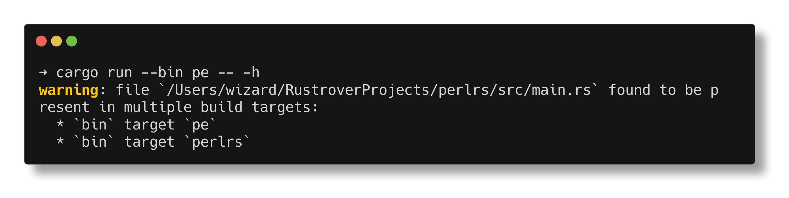

```
 ██████╗ ███████╗██████╗ ██╗     ██████╗ ███████╗
 ██╔══██╗██╔════╝██╔══██╗██║     ██╔══██╗██╔════╝
 ██████╔╝█████╗  ██████╔╝██║     ██████╔╝███████╗
 ██╔═══╝ ██╔══╝  ██╔══██╗██║     ██╔══██╗╚════██║
 ██║     ███████╗██║  ██║███████╗██║  ██║███████║
 ╚═╝     ╚══════╝╚═╝  ╚═╝╚══════╝╚═╝  ╚═╝╚══════╝
```

[](https://github.com/MenkeTechnologies/perlrs/actions/workflows/ci.yml)
[](https://crates.io/crates/perlrs)
[](https://crates.io/crates/perlrs)
[](https://docs.rs/perlrs)
[](https://opensource.org/licenses/MIT)

### `[PARALLEL PERL5 INTERPRETER // RUST-POWERED EXECUTION ENGINE]`

 ┌──────────────────────────────────────────────────────────────┐
 │ STATUS: ONLINE &nbsp;&nbsp; CORES: ALL &nbsp;&nbsp; SIGNAL: ████████░░       │
 └──────────────────────────────────────────────────────────────┘

> *"There is more than one way to do it — in parallel."*

---

## [0x00] OVERVIEW

`perlrs` is a Perl 5 compatible interpreter written in Rust that brings native parallelism to Perl scripting. It parses and executes Perl 5 scripts with rayon-powered work-stealing parallel primitives across all available CPU cores.

 ┌──────────────────────────────────────────────────────────────┐
 │ RAYON THREADS: ALL CORES &nbsp;&nbsp; REGEX: SIMD-ACCELERATED         │
 │ BINARY SIZE: 2MB STRIPPED &nbsp;&nbsp; BUILD: LTO + O3               │
 └──────────────────────────────────────────────────────────────┘

### Runtime values

`PerlValue` is a **NaN-boxed** `u64`: immediates (`undef`, inline `i32`, raw non-NaN `f64` bits) and tagged **heap** pointers (`Arc<HeapObject>`) for oversized integers, boxed floats, strings, arrays, hashes, refs, regexes, atomics, channels, etc. The public API uses constructors (`PerlValue::integer`, `::string`, …) and accessors (`as_integer`, `as_str`, `as_array_vec`, `with_heap`, …)—not `match` on constructor names, which are plain functions and cannot appear in patterns. Read-only heap access uses `with_heap` / `heap_ref` (borrow through the stored `Arc::into_raw` pointer without refcount churn); `heap_arc` / `Clone` still bump the `Arc` when an owned handle is needed. `Drop` decrements via `Arc::from_raw`. Profile hot paths if you tune performance: dispatch and allocation still dominate many workloads.

---

## [0x01] SYSTEM REQUIREMENTS

- Rust toolchain // `rustc` + `cargo`

## [0x02] INSTALLATION

#### DOWNLOADING PAYLOAD FROM CRATES.IO

```sh
cargo install perlrs
```

#### COMPILING FROM SOURCE

```sh
git clone https://github.com/MenkeTechnologies/perlrs
cd perlrs
cargo build --release
```

[perlrs on Crates.io](https://crates.io/crates/perlrs)

#### ZSH COMPLETION // TAB-COMPLETE ALL THE THINGS

```sh
# copy to a directory in your fpath
cp completions/_perlrs /usr/local/share/zsh/site-functions/_perlrs
cp completions/_pe /usr/local/share/zsh/site-functions/_pe

# or add the completions directory to fpath in your .zshrc
fpath=(/path/to/perlrs/completions $fpath)

# then reload completions
autoload -Uz compinit && compinit
```

After reloading your shell, `pe <TAB>` will complete all flags, options, and script files.

---

## [0x03] USAGE

#### INTERACTIVE REPL // `pe` WITH NO SCRIPT

When you run the **`pe`** binary **from a terminal** with **no program file**, **no `-e` / `-E`**, and not in **`-n` / `-p`** (or other batch-only modes such as **`-c`**, **`--ast`**, **`--fmt`**, **`--profile`**, **`--explain`**, **`-u`**), it starts a **readline** session: line editing, history (saved to **`~/.perlrs_history`** when possible), and **Tab** completion for keywords/builtins, **`$scalar` / `@array` / `%hash`** names in scope, subroutine names, and **file paths** (merged with the word list when both apply — e.g. `./` or a partial filename in the current directory). Type **`exit`** or **`quit`** or send **EOF** (Ctrl-D) to leave. If stdin is **not** a TTY (e.g. a pipe), **`pe`** reads **one line** from stdin like **`perlrs`**. The **`perlrs`** binary keeps the previous behavior for the same flags (read a single line from stdin when no script is given).

#### EXECUTING INLINE CODE // DIRECT INJECTION

```sh
# inject a single line of perl
pe -e 'print "Hello, world!\n"'

# execute a script file
pe script.pl arg1 arg2

# check syntax without executing
pe -c script.pl

# dump abstract syntax tree as JSON (linting, IDE tooling, formatters, static analysis)
pe --ast script.pl
pe --ast -e 'sub foo { 1 }'

# pretty-print parsed Perl to stdout (best-effort; tree-walker-oriented AST; no execution)
pe --fmt script.pl
pe --fmt -e 'my $x = 1; say $x'

# wall-clock profile: per-statement and per-sub timings on stderr (tree-walker only; VM disabled)
pe --profile script.pl

# expanded hints for error codes (E0001, E0002, …)
pe --explain E0001
```

#### `__DATA__` // EMBEDDED DATA HANDLE

A line whose trimmed text is exactly `__DATA__` ends the program text. Everything after that line is stored as bytes on the **`DATA`** input handle, so `<DATA>` and `readline` on **`DATA`** read that trailing section (same idea as Perl). Shebang stripping and **`-x`** extraction apply only to the program portion above the marker.

#### PROCESSING DATA STREAMS // STDIN OPERATIONS

```sh
# line-by-line processing
echo "data" | pe -ne 'print uc $_'

# auto-print mode (like sed)
cat file.txt | pe -pe 's/foo/bar/g'

# in-place edit on named files (`-i` / `-i.bak` like Perl; `$^I` in Perl code)
pe -i -pe 's/foo/bar/g' file1.txt file2.txt

# slurp entire input at once
cat file.txt | pe -gne 'print length($_), "\n"'

# auto-split fields
echo "a:b:c" | pe -a -F: -ne 'print $F[1], "\n"'
```

#### PARALLEL EXECUTION // MULTI-CORE OPERATIONS

```perl
# parallel map — transform elements across all cores
my @doubled = pmap { $_ * 2 } @data;

# optional progress bar on stderr (updates as items complete; uses \r, then a final newline)
my @out = pmap { heavy($_) } @huge, progress => 1;

# parallel map in batches (one interpreter per chunk — amortizes spawn cost)
my @out = pmap_chunked 1000 { $_ ** 2 } @million_items;

# sequential left fold vs parallel tree fold (use preduce only for associative ops)
my $sum = reduce { $a + $b } @numbers;
my $psum = preduce { $a + $b } @numbers;

# parallel fold with explicit identity — each chunk starts from a clone of `EXPR`; hash
# accumulators merge by adding counts per key; other types use the same block to combine partials
my $histogram = preduce_init {}, {
    my ($acc, $item) = @_;
    $acc->{$item}++;
    $acc
} @words;

# fused parallel map + reduce — no full intermediate array (associative reduce only)
my $psum2 = pmap_reduce { $_ * 2 } { $a + $b } @numbers;

# optional progress for pgrep / preduce (stderr bar, same as pmap)
my @g = pgrep { $_ > 0 } @nums, progress => 1;
my $x = preduce { $a + $b } @nums, progress => 1;

# thread-safe memoization for parallel blocks (key = stringified $_)
my @once = pcache { expensive($_) } @inputs;

# lazy pipeline (ops run on collect(); chain with anonymous subs)
my @result = pipeline(@data)
    ->filter(sub { $_ > 10 })
    ->map(sub { $_ * 2 })
    ->take(100)
    ->collect();

# parallel grep — filter elements in parallel
my @evens = pgrep { $_ % 2 == 0 } @data;

# parallel foreach — execute side effects concurrently
pfor { process($_) } @items;

# fan — run a block N times in parallel (`$_` is 0..N-1)
fan 8 { work($_) }

# typed channels — pass messages between parallel blocks (unbounded or bounded)
my ($tx, $rx) = pchannel();
my ($t2, $r2) = pchannel(128);   # bounded capacity

# multi-stage parallel pipeline (bounded queues between stages = backpressure)
my $n = par_pipeline(
    source  => sub { readline(STDIN) },
    stages  => [ sub { parse_json($_) }, sub { transform($_) } ],
    workers => [4, 2],
    buffer  => 256,   # optional; default 256 slots per inter-stage channel
);
# returns scalar: count of items processed by the last stage

# multiplexed recv (Go-style select via crossbeam `Select`)
my ($tx1, $rx1) = pchannel();
my ($tx2, $rx2) = pchannel();
$tx1->send("first");
my ($val, $idx) = pselect($rx1, $rx2);  # $idx is 0-based (first arg = 0)
my ($v2, $i2) = pselect($rx1, $rx2, timeout => 0.5);  # $i2 is -1 on timeout

# single-path file watcher (same engine as pwatch; one path + callback)
watch "/tmp/x", sub { say $_ };

# HTTP: blocking fetch vs async task handle vs parallel batch GET
my $body = fetch("https://example.com/");
my $task = fetch_async("https://example.com/");   # not `async_fetch` (lexer: keyword `async`)
my $json = await fetch_async_json("https://api.example.com/x");
my @bodies = par_fetch(@urls);

# parallel CSV → array of hashrefs (CPU-parallel row conversion after parse)
my @rows = par_csv_read("data.csv");

# deque — double-ended queue (not in stock Perl)
my $q = deque();
$q->push_back(1); $q->push_front(0);
# pop_front / pop_back / size (or len)

# heap — priority queue with a Perl comparator (`$a` / `$b`, like `sort`)
my $pq = heap(sub { $a <=> $b });
$pq->push(3); my $min = $pq->pop();

# parallel sort — sort using all cores
my @sorted = psort { $a <=> $b } @data;

# chain parallel operations
my @result = pmap { $_ ** 2 } pgrep { $_ > 100 } @data;

# parallel recursive glob (rayon directory walk), then process files in parallel
my @logs = glob_par("**/*.log");
pfor { process($_) } @logs;

# persistent thread pool (reuse worker OS threads; avoids per-task thread spawn from pmap/pfor)
my $pool = ppool(4);
$pool->submit(sub { heavy_work($_) }, $_) for @tasks;   # optional 2nd arg binds $_
my @results = $pool->collect();

# control thread count
pe -j 8 -e 'my @r = pmap { heavy_work($_) } @data'
```

Each parallel block receives its own interpreter context with captured lexical scope // no data races. Use `mysync` to share state.

**Perl-compat (partial)** — not a full `perl` replacement, but these areas follow Perl 5 more closely than before:

- **Inheritance / `SUPER::` / C3 MRO** — `@ISA` in the package stash (including `our @ISA` outside `main`), C3 method resolution order, and `$obj->SUPER::method` to invoke the next class in the linearized chain. The bytecode compiler tracks the current `package` so VM execution stores and reads `Pkg::ISA` like the tree interpreter.
- **`tie`** — `tie $scalar`, `tie @array`, `tie %hash` with `TIESCALAR` / `TIEARRAY` / `TIEHASH`; `FETCH` / `STORE` on the blessed object for reads and writes; tied hashes also dispatch **`exists $h{k}`** → `EXISTS` and **`delete $h{k}`** → `DELETE` when those subs exist (not every other `tie` method yet).
- **`$?` and `$|`** — last child exit status for `system`, `` `...` `` / `capture`, and `close` on pipe children (POSIX-style packed status); `$|` enables autoflush after `print` / `printf` to resolved handles.
- **Typeglobs (limited)** — `*NAME` as a value and `local *LHS = *RHS` to alias filehandle names for `open` / `print` / `close` (no full glob assignment semantics).
- **`use overload`** — `use overload 'op' => 'method', …` or `'op' => \&handler` registers per-class overloads in the current package; one statement may combine several ops (e.g. `use overload '+' => \&add, '""' => \&stringify;`). Binary ops dispatch to the named method with `(invocant, other)`; missing ops may use **`nomethod`** with a third argument, the op key string (e.g. `"+"`). Unary **`neg`**, **`bool`** (for `!` / `not` after the overload result), and **`abs`** are supported on blessed values. `use overload '""' => 'as_string'` (or the key `""` / `'""'`) drives stringification for `print`, **`sprintf` `%s`**, interpolated strings, and similar contexts. **`fallback => 1`** is accepted in the pragma list (full Perl fallback coercion is not). Tree interpreter only for some forms (VM falls back when bytecode cannot represent the expression).

**`%SIG` (Unix)** — `SIGINT`, `SIGTERM`, `SIGALRM`, and `SIGCHLD` can be set to a code ref; handlers run **between statements** (not mid-op). `IGNORE` / `DEFAULT` are recognized as no-ops.

**SQLite** — `query` still loads all rows; a lazy **`stream`-style** row iterator is not wired yet (use `LIMIT`/`OFFSET` or chunk in Perl for huge result sets).

Perl **`format` / `write`** report generation is **not** implemented (parser focus elsewhere).

#### EXECUTION TRACE // `trace`

Wrap parallel (or any) code to print **`mysync` scalar** mutations to **stderr** — useful when debugging races or ordering. Under `fan N { }`, lines are tagged with the worker index (same as `$_`).

```perl
mysync $counter = 0;
trace { fan 10 { $counter++ } };
# stderr: [thread 0] $counter: 0 → 1
# stderr: [thread 3] $counter: 1 → 2
# ... (order varies)
```

Outside `fan`, mutations are labeled `[main]`.

#### TIMER // `timer`

Wall-clock benchmark: **`timer { BLOCK }`** returns elapsed time as a **float** in **milliseconds** (sub-ms resolution).

```perl
my $elapsed = timer { heavy_work() };
print "took ${elapsed}ms\n";
```

#### ASYNC / AWAIT // lightweight I/O parallelism

**`async { BLOCK }`** runs the block on a **worker thread** and returns a task handle immediately. **`await EXPR`** joins: if `EXPR` is that handle, it blocks until the block finishes and returns its value; otherwise `await` passes the value through.

Use this to overlap **`fetch_url`**, **`slurp`**, or other I/O-bound work without blocking the main interpreter until you **`await`**.

```perl
my $data = async { fetch_url("https://example.com/") };
my $file = async { slurp("big.csv") };
print await($data), await($file);
```

Each `async` worker gets a **clone of the interpreter’s subs** and a **captured lexical scope** (including **`mysync`** storage), so closures and shared state behave like other parallel primitives.

#### NATIVE CSV / SQLITE / STRUCTS // data scripting

**HTTP** — [`ureq`](https://crates.io/crates/ureq) blocking GET. **`fetch(url)`** returns the response body as a string. **`fetch_json(url)`** parses JSON with [`serde_json`](https://crates.io/crates/serde_json): JSON objects become **hashrefs**, arrays become **arrays**, `null` → `undef`, numbers → integers or floats. (Lower-level **`fetch_url $url`** is still available as an expression form.)

**JSON encode/decode** — **`json_encode($value)`** turns a Perl value into a JSON string (scalars, array/hash refs, blessed objects serialize the underlying value; unsupported types are errors). **`json_decode($string)`** parses JSON into Perl values with the same mapping as **`fetch_json`**. Use these for APIs, config files, and round-tripping data without an HTTP round trip.

**CSV** — [`csv`](https://crates.io/crates/csv) backed. `csv_read(path)` returns an array of **hashrefs** (first row is the header). `csv_write(path, row, …)` or `csv_write(path, \@rows)` writes rows (each row is a hash or hashref); header columns are the union of keys in first-seen order.

**DataFrame** — `dataframe(path)` loads the same CSV shape into a **columnar** value (not an array of hashrefs). Methods: `->nrow` / `->nrows`, `->ncol` / `->ncols`; `->filter(sub { … })` runs the coderef with `$_` bound to each row as a hashref; `->group_by("col")` sets the grouping column for a following `->sum("amount")`, which returns a small two-column frame (group key, sum). Without `group_by`, `->sum("col")` returns a single numeric total. JSON encoding represents a frame as an array of row objects.

**SQLite** — embedded database via [`rusqlite`](https://crates.io/crates/rusqlite) with **bundled** libsqlite (no system SQLite required). `sqlite(path)` returns a handle: `->exec(sql, ?…)`, `->query(sql, ?…)` (rows as hashrefs), `->last_insert_rowid`.

**Structs** — `struct Name { field => Type, … }` with `Type` one of `Int`, `Str`, `Float`. Constructor: `Name->new(field => value, …)`. Field read: `$obj->fieldname` (same as a method call). The VM builds native struct instances (not plain blessed hashes) when the struct is declared in the same program.

**Typed `my`** — `typed my $x : Int` (or `Str` / `Float`): assignments are checked at runtime; mismatches are type errors.

```perl
my $data = fetch_json("https://api.example.com/users/1");
say $data->{name};

my $payload = json_encode({ ok => 1, n => 42 });
my $roundtrip = json_decode($payload);

my $raw = fetch("https://example.com/");

my @rows = csv_read("data.csv");
csv_write("out.csv", { name => "a", id => "1" });

my $db = sqlite("app.db");
$db->exec("CREATE TABLE t (id INTEGER, name TEXT)");
my @r = $db->query("SELECT * FROM t WHERE id > ?", 0);

typed my $n : Int;
$n = 42;

struct Point { x => Float, y => Float };
my $p = Point->new(x => 1.5, y => 2.0);
say $p->x;
```

#### THREAD-SAFE SHARED STATE // `mysync`

`mysync` declares variables backed by `Arc<Mutex>` that are shared across parallel blocks. All reads/writes go through the lock automatically. Compound operations (`++`, `+=`, `.=`, and `|=`, `&=` on scalars holding a native `Set`) are fully atomic — the lock is held for the entire read-modify-write cycle.

For **`mysync` scalars that hold a `Set`** (from `mysync $s = Set->new(...)`), union (`|`) and intersection (`&`) treat the stored value as a set even when the underlying storage is the mutex-wrapped scalar; bitwise `|` / `&` on plain integers is unchanged.

**`deque()` and `heap(...)`**: `mysync $q = deque()` (and `mysync $pq = heap(sub { $a <=> $b })`) stores the value without an extra `Atomic` shell — they already use `Arc<Mutex<…>>`. Use them like any other `mysync` scalar in `fan` / `pmap` / `pfor` so all workers share one queue or heap.

```perl
# shared scalar — atomic increment
mysync $counter = 0;
fan 10000 { $counter++ };
print $counter;  # always exactly 10000

# shared array — thread-safe push/pop/shift
mysync @results;
pfor { push @results, $_ * $_ } (1..100);
print scalar @results;  # always exactly 100

# shared hash — atomic element access
mysync %histogram;
pfor { $histogram{$_ % 10} += 1 } (0..999);
# each bucket is exactly 100

# mix all three
mysync $total = 0;
mysync @items;
mysync %stats;
fan 1000 {
    $total++;
    push @items, $_;
    $stats{$_ % 5} += 1;
};
# $total == 1000, @items == 1000, sum(%stats) == 1000
```

Without `mysync`, each parallel thread gets an independent copy — changes are not visible to other threads or the parent. With `mysync`, all threads share the same underlying storage via `Arc<Mutex>`.

 ┌──────────────────────────────────────────────────────────────┐
 │ ATOMIC OPS: $x++ &nbsp;&nbsp; ++$x &nbsp;&nbsp; $x += N &nbsp;&nbsp; $x .= "s" &nbsp;&nbsp; $s |= $t (Set) │
 │ ATOMIC OPS: $h{k} += N &nbsp;&nbsp; $a[i] += N &nbsp;&nbsp; push @a, $v      │
 │ LOCK SCOPE: held for full read-modify-write // zero races   │
 └──────────────────────────────────────────────────────────────┘

---

## [0x04] CLI FLAGS



---

## [0x05] SUPPORTED PERL FEATURES

#### DATA TYPES
- Scalars (`$x`), arrays (`@a`), hashes (`%h`)
- References: `\$x`, `\@a`, `\%h`, `\&sub`
- Array refs `[1,2,3]`, hash refs `{a => 1}`
- Code refs / closures `sub { ... }`
- Regex objects `qr/.../`
- Blessed references (basic OOP)
- `typed my $x : Int|Str|Float` (runtime-checked assignments)
- `struct Name { field => Type, … }` with `Name->new(…)` and `$obj->field`
- Native CSV (`csv_read` / `csv_write`), columnar `dataframe(path)` with `->filter` / `->group_by` / `->sum`, and SQLite (`sqlite` + `->exec` / `->query`)
- `fetch` / `fetch_json` (HTTP GET via `ureq`; JSON → Perl values); `json_encode` / `json_decode` (standalone JSON string ↔ Perl values)

#### CONTROL FLOW
- `if`/`elsif`/`else`, `unless`
- `while`, `until`, `do { } while/until` (block runs before the first condition check)
- `for` (C-style), `foreach`
- `last`, `next`, `redo` with labels
- Postfix: `expr if COND`, `expr unless COND`, `expr while COND`, `expr for @list`
- Ternary `?:`
- **`try { } catch ($err) { }` [`finally { }`]** — statement form only (not an arbitrary expression, so not `my $x = try { … }`); catches `die` and other runtime errors (not `exit`, not `last`/`next`/`return` flow); the error string is bound to the scalar in `catch`. Optional **`finally`** runs after a successful `try` or after `catch` finishes (including if `catch` propagates an error); if `finally` fails, that error is returned (Perl-style).
- **`given (EXPR) { when (COND) { } default { } }`** — topic is **`$_`**; `when` tests in order (regex `=~` for regex literals, string equality for string/number literals, otherwise string comparison to the evaluated condition); first match wins; put **`default` last** (tree-walker only)
- **Algebraic `match (EXPR) { PATTERN => EXPR, … }`** (perlrs) — expression form with explicit subject; arms are tested in order. Patterns: **`_`** (wildcard); **`/regex/`** (stringified subject); **literal / parenthesized expression** (smart-match against the subject); **`[1, 2, *]`** (array or array-ref: prefix elements match, optional **`*`** tail); **`{ name => $n }`** (hash or hash-ref: required keys; **`$n`** binds the value for the arm body). Bindings are scoped to that arm only. No matching arm is a runtime error (use **`_`**). Tree interpreter only (bytecode falls back).
- **`eval_timeout SECS { }`** — runs the block on a **worker OS thread**; the main thread waits up to **`SECS`** seconds via `recv_timeout` (no Unix `alarm`); on timeout you get a runtime error (the worker may keep running in the background—avoid relying on cancellation for correctness)

#### OPERATORS
- Arithmetic: `+`, `-`, `*`, `/`, `%`, `**`
- String: `.` (concat), `x` (repeat)
- Comparison: `==`, `!=`, `<`, `>`, `<=`, `>=`, `<=>`
- String comparison: `eq`, `ne`, `lt`, `gt`, `le`, `ge`, `cmp`
- Logical: `&&`, `||`, `//`, `!`, `and`, `or`, `not`
- Bitwise: `&`, `|`, `^`, `~`, `<<`, `>>` (for native `Set` values, `|` / `&` are union / intersection instead of integer bitwise ops)
- Assignment: `=`, `+=`, `-=`, `*=`, `/=`, `.=`, `|=`, `&=`, `//=`, etc.
- Regex: `=~`, `!~`
- Range: `..`
- Arrow dereference: `->`

#### REGEX ENGINE
- Match: `$str =~ /pattern/flags`
- Dynamic pattern (string): `$str =~ $pattern` and `$str !~ $pattern` (bytecode `RegexMatchDyn`; empty flags)
- Substitution: `$str =~ s/pattern/replacement/flags`
- Transliterate: `$str =~ tr/from/to/`
- Flags: `g`, `i`, `m`, `s`, `x`
- Capture variables: `$1`, `$2`, … (all numbered groups, not only 1–9); named groups `(?<name>…)` or `(?P<name>…)` populate **`%+`** and **`$+{name}`** (same rules as the Rust `regex` crate)
- Literal spans: `\Q…\E` (metacharacters escaped); `quotemeta` for dynamic patterns
- Quote-like: `m//`, `qr//`

#### SUBROUTINES
- Named subs with `sub name { ... }`
- Anonymous subs / closures
- Recursive calls
- `@_` argument passing, `shift`, `return`
- `return EXPR if COND` (postfix modifiers on return)
- **`AUTOLOAD`**: missing subs and methods dispatch to `sub AUTOLOAD` with `$AUTOLOAD` set to the fully qualified name (e.g. `main::foo`, `MyClass::bar`)

#### BUILT-IN FUNCTIONS

 ┌──────────────────────────────────────────────────────────────┐
 │ **Array**: push, pop, shift, unshift, splice, reverse,      │
 │ sort, map, grep, reduce, preduce, scalar                    │
 │ **Hash**: keys, values, each, delete, exists                │
 │ **String**: chomp, chop, length, substr, index, rindex,     │
 │ split, join, sprintf, printf, uc, lc, ucfirst, lcfirst,     │
 │ chr, ord, hex, oct, crypt, fc, pos, study, quotemeta          │
 │ **Binary**: pack, unpack (subset A a N n V v C Q q Z H x;   │
 │ `*` repeat; result is byte data)                              │
 │ **Numeric**: abs, int, sqrt, sin, cos, atan2, exp, log,     │
 │ rand, srand                                                 │
 │ **I/O**: print, say, printf, open (files + `-|` / `|-`       │
 │ piped shell; returns a handle value), close, eof, readline, │
 │ handle methods `->print` / `->say` / `->printf` / `->getline` │
 │ / `->readline` / `->close` / `->eof` / `->getc` / `->flush` …, │
 │ slurp, capture (structured shell: ->stdout/stderr/exit),   │
 │ binmode, fileno, flock, getc, sysread, syswrite, sysseek,  │
 │ select (timeout sleep / handle no-op), truncate             │
 │ **Directory**: opendir, readdir, closedir, rewinddir,        │
 │ telldir, seekdir                                              │
 │ **File tests**: -e, -f, -d, -l, -r, -w, -s, -z, -t (TTY)   │
 │ **System**: system, exec, exit, chdir, mkdir, unlink, rename, │
 │ chmod, chown (Unix), stat, lstat, link, symlink, readlink,   │
 │ glob, glob_par, ppool, barrier,                               │
 │ **Data**: csv_read, csv_write (header row → AoH), dataframe, │
 │ sqlite                                                        │
 │ fork, wait, waitpid, kill, alarm, sleep, times (Unix where  │
 │ noted in source)                                            │
 │ **Socket** (std::net): socket, bind, listen, accept,         │
 │ connect, send, recv, shutdown                               │
 │ **Type**: defined, undef, ref, bless                        │
 │ **Set**: `Set->new(…)` — native set; `|` union, `&` intersection │
 │ **Control**: die, warn, eval, do, require, caller,         │
 │ wantarray (void / scalar 0 / list 1; bytecode passes context), │
 │ `goto EXPR` (same-block labels), `continue { }` on loops, │
 │ `prototype` on code refs; sub prototypes parsed on `sub`     │
 └──────────────────────────────────────────────────────────────┘

#### EXTENSIONS BEYOND STOCK PERL 5
- **`csv_read PATH` / `csv_write PATH, \@rows`** — native CSV via the Rust `csv` crate. The first row is column headers; each data row is a hashref (string cells). `csv_write` uses the first row’s key order for columns.
- **`dataframe(PATH)`** — same CSV load as `csv_read`, but stored columnar; methods `->filter`, `->group_by`, `->sum`, `->nrow` / `->ncol` (see **DataFrame** under native CSV above).
- **`sqlite(PATH)`** — embedded SQLite via `rusqlite` (bundled libsqlite). Handle methods: `->exec(SQL, ?bind…)`, `->query(SQL, ?bind…)` (array of hashrefs), `->last_insert_rowid`.
- **`par_lines PATH, sub { ... }`** — memory-map the file, split into line-aligned byte chunks, process chunks in parallel with rayon; each line sets `$_` for the coderef (CRLF-safe; tree-walker only; use `mysync` for shared counters across workers).
- **`par_pipeline(source => CODE, stages => [...], workers => [...], buffer => N?)`** — one **source** coderef (scalar return per call; **`undef`** ends the stream), then each **stage** runs on `$_` with `workers[i]` OS threads pulling from a **bounded** crossbeam channel from the previous stage (backpressure). Optional **`buffer`** sets queue capacity per link (default 256). Blocks until the pipeline drains; return value is the number of items handled by the **last** stage (ordering across items is not preserved when a stage has multiple workers). Source and stage bodies use the same **capture** rules as `pmap`/`ppool` (lexical scalars are shared; **arrays** are not copied into the snapshot—use scalars, package variables, or handles like `STDIN`).
- **`pwatch GLOB, sub { ... }`** — register native file/directory watches with the `notify` crate (inotify/kqueue/FSEvents); block in the event loop and dispatch each glob-matching path to the coderef on a rayon worker with `$_` set to the path (tree-walker only; use `mysync` for shared state).
- **`barrier(N)`** — returns a handle backed by `std::sync::Barrier`; `->wait` for phased parallelism (e.g. with `fan`). Party count is clamped to at least 1 (bytecode + tree-walker).
- **`sort` / `psort` fast path** — `{ $a <=> $b }`, `{ $a cmp $b }`, `{ $b <=> $a }`, `{ $b cmp $a }` compare without invoking the block per pair (VM + tree-walker).
- **`reduce` / `preduce`** — list fold with `$a` (accumulator) and `$b` (next item); `reduce` is strictly left-to-right; `preduce` uses rayon (order not fixed; use only when the operation is associative).
- **`preduce_init`** — `preduce_init EXPR, { BLOCK } @list`: parallel fold starting from **`EXPR`** (clone per chunk); empty list returns `EXPR`. **`$a` / `$b`** are the accumulator and next element; **`@_`** is `($a, $b)`. Hash (or hashref) partials are merged by **adding numeric values per key**; for other accumulators the block must combine two partial results associatively (same idea as `preduce`).
- **`frozen my`** — immutable bindings (reassignment rejected in the bytecode path).
- **`typed my $x : Type`** — optional scalar types (`Int`, `Str`, `Float`) with **runtime** checks on declaration and every assignment; `typed my` runs on the tree-walker (bytecode falls back when the program uses it).
- **`try` / `given` / `match (…) { … }` / `eval_timeout`** — implemented in the tree interpreter only; the bytecode compiler returns unsupported for these constructs, so execution falls back to `execute_tree` automatically.

#### OTHER FEATURES
- `Interpreter::execute` returns `Err(ErrorKind::Exit(code))` for `exit` (including code 0); the `perlrs` binary maps that to `process::exit`.
- **`@INC` / `%INC` / `require` / `use`** — The `perlrs` / `pe` driver builds `@INC` by: each **`-I`** directory, then **`<crate>/vendor/perl`** when present (e.g. a stub **`List/Util.pm`** so `require List::Util` updates **`%INC`**), then the same paths **system `perl` reports for `@INC`** (via `perl -e 'print join "\n", @INC'`, so other core/site `.pm` paths match Perl’s search order), then the **script’s directory** (when the program file is not `-e` / `-` / `repl`), then **`PERLRS_INC`**, then **`.`** (duplicates removed). Set **`PERLRS_NO_PERL_INC`** to omit the `perl` query (e.g. no `perl` on `PATH`). **`List::Util`** (all **`EXPORT_OK`** names from Perl 5’s module, including **`reduce`**, **`any`**, **`pairs`**, **`zip`**, …) is implemented **natively in Rust** (`src/list_util.rs`) and registered on interpreter startup; core Perl still loads XS for these, but perlrs does not. Pure perlrs execution is still **not** full Perl 5: many other real `.pm` files (especially XS) will not run even when found. Relative paths (`Foo::Bar` → `Foo/Bar.pm`) are searched in order; successful loads record the relative path in **`%INC`**; repeated `require` is a no-op. **`use Module;`** is processed in **source order** before `BEGIN` blocks (and before the VM main chunk runs). After a successful load, **`use Module qw(a b);`** imports only those names, and each must appear in **`our @EXPORT`** or **`our @EXPORT_OK`** in the loaded module (Exporter-style). Bare **`use Module;`** imports **`@EXPORT`** only; if the module never sets **`our @EXPORT`** / **`our @EXPORT_OK`**, the legacy rule applies: import every top-level sub under that package. **`use Module qw();`** imports nothing. **Qualified calls** like **`Foo::bar()`** are valid syntax. Built-in pragmas (`strict`, `warnings`, `utf8`, …) do not load a file. Version-only `require` (e.g. `require 5.010`) succeeds without loading.
- **Pragmas (porting)** — `use strict` enables **refs / subs / vars**; `use strict 'refs'` or `use strict qw(refs subs)` selects modes; `no strict` clears all, `no strict 'refs'` clears one. **Runtime:** **`strict refs`** rejects symbolic scalar/array/hash derefs (string used as a variable name) with a Perl-like message; **`$$foo`** is parsed as symbolic scalar deref of **`$foo`** (falls back to the tree interpreter when bytecode is compiled). **`strict vars`** requires a visible binding (`my`/`our`/prior assignment in scope) for unqualified scalars, arrays, and hashes (package-qualified names and built-in specials like `$_`, `$1`, … are exempt); **`strict subs`** appends a hint to undefined subroutine errors. **`use warnings` / `no warnings`** toggle the interpreter warnings flag (reserved for future warning surfaces). **`feature_bits`** (crate **`FEAT_*`**) are set by **`use feature`** / **`no feature`**; **`say`** is gated by **`FEAT_SAY`** (on by default like Perl 5.10+; disable with **`no feature 'say'`** or **`no feature;`**). **`use utf8` / `no utf8`** set **`utf8_pragma`**. **`no`** pragmas run in the same **prepare** phase as **`use`**. The interpreter starts with **`@ARGV`**, **`@_`**, **`%ENV`**, and **`@INC`/`%INC`** pre-bound so **`strict vars`** matches typical Perl scripts.
- `package` declarations
- `BEGIN`/`END` blocks
- String interpolation with `$var`, `$hash{key}`, `$array[idx]`
- Heredocs (`<<EOF`)
- `qw()`, `q()`, `qq()`
- POD documentation skipping
- Shebang line handling
- **Special variables** — Not full perlvar(5): see [`SPECIAL_VARIABLES.md`](SPECIAL_VARIABLES.md) for `$_`, `$/`, `$!`, `$1`…, `%+`, `@-`/`@+`, `$]`/`$;`, **`$^O`** / **`$^T`** / **`$^V`** / **`$^E`** / **`$^H`**, **`${^WARNING_BITS}`** / **`${^GLOBAL_PHASE}`**, **`$<`**/**`$>`**/**`$(`**/**`$)`** (Unix ids; non-Unix stubs), **`${^MATCH}`** / **`${^PREMATCH}`** / **`${^POSTMATCH}`** (same data as `$&` / `` $` `` / `$'` when driven by the regex engine), `$^I`/`$^D`/`$^P`/`$^S`/`$^W`, `$ARGV` with `<>`, `@ARGV`/`%ENV`/`@INC`/`%INC`, `%SIG` (hash only; OS delivery not wired), **`$?`** / **`$|`** (see Perl-compat bullets above). Still missing vs Perl 5: full **`$!`**/**`$@`** dualvar; real **`%SIG`** delivery; **`English`**; full **`$^V`** as a version object; **`${^GLOBAL_PHASE}`** transitions (perlrs keeps a string, default **`RUN`**).

---

## [0x06] ARCHITECTURE

```
 ┌─────────────────────────────────────────────────────┐
 │  Source Code                                        │
 │      │                                              │
 │      ▼                                              │
 │  Lexer (src/lexer.rs)                               │
 │      │ Tokens                                       │
 │      ▼                                              │
 │  Parser (src/parser.rs)                             │
 │      │ AST                                          │
 │      ▼                                              │
 │  Interpreter (src/interpreter.rs)                   │
 │      ├── Sequential: map, grep, sort, foreach       │
 │      └── Parallel:   pmap, pgrep, psort, pfor, fan │
 │              │                                      │
 │              ▼                                      │
 │          RAYON WORK-STEALING SCHEDULER              │
 │          ▓▓▓▓▓▓▓▓▓▓▓▓▓▓▓▓▓▓▓▓▓▓▓▓▓▓               │
 │          CORE 0 │ CORE 1 │ ... │ CORE N             │
 └─────────────────────────────────────────────────────┘
```

- **Lexer** // Context-sensitive tokenizer handling Perl's ambiguous syntax (regex vs division, hash vs modulo, heredocs, interpolated strings)
- **Parser** // Recursive descent with Pratt precedence climbing for expressions
- **Interpreter** // Tree-walking execution with proper lexical scoping, `Arc<RwLock>` for thread-safe reference types
- **Parallelism** // Each parallel block gets an isolated interpreter with captured scope; rayon handles work-stealing scheduling
- **VM** // `src/vm.rs` match-dispatch loop; compiled subs use **slot** ops for frame-local `my` scalars (`GetScalarSlot`, `PreIncSlot`, …, O(1)); non-special names use **plain** load/store ops to skip the special-variable dispatch path; string `eq` / `cmp` compare heap strings without per-op `String` allocations when both operands are heap strings; the execution budget is checked on a fixed stride through the hot loop (not once per opcode). Further speedups: op fusion, computed-goto dispatch (not implemented here)
- **JIT (experimental)** // `src/jit.rs` — Cranelift **method JIT** for **pure integer** linear bytecode (`LoadInt`, `Add` / `Sub` / `Mul`, `Negate`, `Pop`, `Dup`, optional trailing `Halt`). Uses native `i64` wrapping arithmetic to match the VM’s integer fast path; all other opcodes still run in the interpreter. Eligible chunks are detected at VM entry and compiled regions are cached (bounded). Hot-loop tracing, type guards, and slot access from native code are not implemented yet.

---

## [0x07] EXAMPLES

```sh
pe examples/fibonacci.pl
pe examples/text_processing.pl
pe examples/parallel_demo.pl
```

---

## [0x08] BENCHMARKS

 ┌──────────────────────────────────────────────────────────────┐
 │ BENCHMARK SUITE // perlrs vs perl 5.42.2 // Apple M5 18-core │
 └──────────────────────────────────────────────────────────────┘

```
  TEST                    perl5(ms) perlrs(ms)      RATIO
  ──────────────────── ───────── ────────── ─────
  fib(25)                    19.4ms     22.7ms      1.17x
  loop 10k                    2.7ms      3.9ms      1.44x
  string .= 10k              2.6ms      4.6ms      1.77x
  hash 1k                     2.6ms      3.5ms      1.35x
  array sort 10k              3.1ms      4.3ms      1.39x
  regex match 1k              3.5ms      4.5ms      1.29x
  map+grep 10k                3.5ms      4.7ms      1.34x
```

> Measured on macOS M-series with `perl v5.42.2` vs `perlrs` release build (LTO + O3).
> Times include process startup (~3.1ms perlrs, ~2.4ms perl5). Run with `bash bench/run_bench.sh`.

#### Analysis

- **All benchmarks within 1.2–1.8x of perl5** — subtracting startup (~0.7ms difference), computation ratios approach parity on most tests
- **fib** is 1.17x — `GetArg` op reads arguments directly from the caller's value stack (no @_ Vec allocation or string-based shift); frame pool recycles scope frames to eliminate per-call allocation
- **regex** is 1.3x — `Arc<Regex>` caching preserves the lazy DFA across calls; the `regex` crate with SIMD matches at near-native Rust speed
- **hash** is 1.35x — approaching parity with perl's heavily optimized HV implementation
- **string** is 1.77x — `$s .= "x"` uses the `ConcatAppend` bytecode op for zero-copy in-place mutation (no string clone)
- **array sort** is 1.4x — `sort { $a <=> $b }` uses a native fast path with `SortWithBlockFast`; `ArrayLen` borrows without cloning
- **Lazy rayon init** — rayon thread pool no longer initializes on startup; spawned only when first parallel op is hit
- **VM eliminates String allocations** — variable access uses raw pointer borrows; regex ops borrow constants via `as_str_or_empty()`; `@INC` paths cached to disk

#### Parallel speedup

```
  fan 18 { system("sleep 0.1") }   →  0.12s total  (vs 1.8s sequential)
```

True parallelism across all cores via rayon work-stealing. The `fan`, `pmap`, `pgrep`, `pfor`, and `psort` commands distribute work automatically.

---

## [0x09] DEVELOPMENT & CI

Pull requests and pushes to `main` run the workflow in [`.github/workflows/ci.yml`](.github/workflows/ci.yml). You can also run it manually from the repository **Actions** tab (**workflow dispatch**). On a pull request, the **Checks** tab (or the merge box) shows the aggregate status; open the **CI** workflow run for per-job logs (Check, Test, Format, Clippy, Doc, Release Build).

Library unit tests (parser smoke batches `parse_smoke_*`, **`parser_shape_tests`**, lexer/token/value/error/scope/`ast`, **`interpreter_unit_tests`**, **`crate_api_tests`**, **`run_semantics_tests`** / **`run_semantics_more`** (`run` coverage), **`bytecode::Chunk`** pool/intern/jump patching, **`compiler`** compile-to-op smoke checks, **`vm`** hand-built bytecode execution, `parse` / `try_vm_execute`); excludes `tests/` integration suite):

```sh
cargo test --lib
```

Integration tests live in `tests/integration.rs` and `tests/suite/` (grouped modules such as `runtime_extra` and `runtime_more` for assignment, builtins, aggregates, control flow, and regex/subs):

```sh
cargo test --test integration
```

Extended parse-only smoke coverage is in `src/parse_smoke_extended.rs` and `src/parse_smoke_batch2.rs` (built only with `cfg(test)`).

CI uses `cargo … --locked`; **`Cargo.lock` is committed** so dependency resolution matches CI and release builds. If you use a global gitignore that ignores `Cargo.lock`, force-add updates when dependencies change: `git add -f Cargo.lock`.

---

## [0xFF] LICENSE

 ┌──────────────────────────────────────────────────────┐
 │ MIT LICENSE // UNAUTHORIZED REPRODUCTION WILL BE MET │
 │ WITH FULL ICE                                        │
 └──────────────────────────────────────────────────────┘

---

```
░░░░░░░░░░░░░░░░░░░░░░░░░░░░░░░░░░░░░░░░░░░░░░░░░░░░░░░░░░░
░░ >>> PARSE. EXECUTE. PARALLELIZE. OWN YOUR CORES. <<< ░░
░░░░░░░░░░░░░░░░░░░░░░░░░░░░░░░░░░░░░░░░░░░░░░░░░░░░░░░░░░░
```

##### created by [MenkeTechnologies](https://github.com/MenkeTechnologies)
