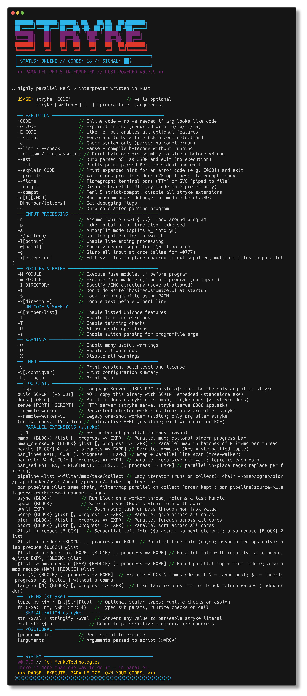

```
 ███████╗████████╗██████╗ ██╗   ██╗██╗  ██╗███████╗
 ██╔════╝╚══██╔══╝██╔══██╗╚██╗ ██╔╝██║ ██╔╝██╔════╝
 ███████╗   ██║   ██████╔╝ ╚████╔╝ █████╔╝ █████╗
 ╚════██║   ██║   ██╔══██╗  ╚██╔╝  ██╔═██╗ ██╔══╝
 ███████║   ██║   ██║  ██║   ██║   ██║  ██╗███████╗
 ╚══════╝   ╚═╝   ╚═╝  ╚═╝   ╚═╝   ╚═╝  ╚═╝╚══════╝
```

[](https://github.com/MenkeTechnologies/strykelang/actions/workflows/ci.yml)
[](https://crates.io/crates/strykelang)
[](https://crates.io/crates/strykelang)
[](https://docs.rs/strykelang)
[](https://opensource.org/licenses/MIT)

### `[THE 2ND FASTEST DYNAMIC LANGUAGE IN THE WORLD]`

> *"There is more than one way to do it — in parallel."*

The 2nd fastest dynamic language runtime ever benchmarked — behind only Mike Pall's LuaJIT, and beating it on 3 of 8 benchmarks. A Perl 5 compatible interpreter in Rust with native parallel primitives, NaN-boxed values, three-tier regex, bytecode VM + Cranelift JIT, streaming iterators, and rayon work-stealing across all cores. Faster than perl5, Python, Ruby, Julia, and Raku on every benchmark.

### Strykelang is under heavy development and will soon replace zsh/fish/bash and all other login shells

### [`Read the Docs`](https://menketechnologies.github.io/strykelang/) &middot; [`Coverage Report`](https://menketechnologies.github.io/strykelang/report.html) &middot; [`Full Reference`](https://menketechnologies.github.io/strykelang/reference.html)

---

## Table of Contents

- [\[0x00\] Overview](#0x00-overview)
- [\[0x01\] Install](#0x01-install)
- [\[0x02\] Usage](#0x02-usage)
- [\[0x03\] Parallel Primitives](#0x03-parallel-primitives)
- [\[0x04\] Shared State (`mysync`)](#0x04-shared-state-mysync)
- [\[0x05\] Native Data Scripting](#0x05-native-data-scripting)
- [\[0x06\] Async / Trace / Timer](#0x06-async--trace--timer)
- [\[0x07\] CLI Flags](#0x07-cli-flags)
- [\[0x08\] Supported Perl Features](#0x08-supported-perl-features)
- [\[0x09\] Architecture](#0x09-architecture)
- [\[0x0A\] Examples](#0x0a-examples)
- [\[0x0B\] Benchmarks](#0x0b-benchmarks)
- [\[0x0C\] Development & CI](#0x0c-development--ci)
- [\[0x0D\] Standalone Binaries (`stryke build`)](#0x0d-standalone-binaries-stryke-build)
- [\[0x0E\] Inline Rust FFI (`rust { ... }`)](#0x0e-inline-rust-ffi-rust-----)
- [\[0x0F\] Bytecode Cache (`.pec`)](#0x0f-bytecode-cache-pec)
- [\[0x10\] Distributed `pmap_on` over SSH (`cluster`)](#0x10-distributed-pmap_on-over-ssh-cluster)
- [\[0x11\] Language Server (`stryke lsp`)](#0x11-language-server-stryke-lsp)
- [\[0x12\] Language Reflection](#0x12-language-reflection)
- [\[0x13\] zshrs Shell](#0x13-zshrs-shell)
- [\[0x14\] Documentation](#0x14-documentation)
- [\[0xFF\] License](#0xff-license)

---

## [0x00] OVERVIEW

`stryke` parses and executes Perl 5 scripts with rayon-powered work-stealing primitives across every CPU core. Highlights:

- **New Parallel Subroutines and |> Pipeline Syntactic Sugar**
- **Runtime values** — `PerlValue` is a NaN-boxed `u64`: immediates (`undef`, `i32`, raw `f64` bits) and tagged `Arc<HeapObject>` pointers for big ints, strings, arrays, hashes, refs, regexes, atomics, channels.
- **Three-tier regex** — Rust [`regex`](https://docs.rs/regex) → [`fancy-regex`](https://docs.rs/fancy-regex) (backrefs) → [`pcre2`](https://docs.rs/pcre2) (PCRE-only verbs).
- **Bytecode VM + JIT** — match-dispatch interpreter with Cranelift block + linear-sub JIT (`src/vm.rs`, `src/jit.rs`).
- **Rayon parallelism** — every parallel builtin uses work-stealing across all cores.
- **Over 3200 standard library functions**

---

## [0x01] INSTALL

```sh
cargo install strykelang
# or from source
git clone https://github.com/MenkeTechnologies/strykelang && cd strykelang && cargo build --release
```

#### Zsh tab completion

```sh
cp completions/_stryke /usr/local/share/zsh/site-functions/_stryke
# or: fpath=(/path/to/stryke/completions $fpath) in .zshrc
autoload -Uz compinit && compinit
```

`stryke <TAB>` then completes flags, options, and script files.

---

## [0x01b] CONCISENESS — STRYKE VS THE WORLD

stryke is the **most concise yet readable ASCII-only general-purpose scripting language** — shorter than Perl, Ruby, Python, and AWK for real-world tasks.

### vs mainstream languages

| Task | stryke | chars | perl | chars | ruby | chars | python | chars |
|------|--------|-------|------|-------|------|-------|--------|-------|
| hello world | `p"hello"` | **8** | `print"hello"` | 12 | `puts"hello"` | 10 | `print("hello")` | 14 |
| sum 1-100 | `p sum 1:100` | **11** | `use List::Util'sum';say sum 1..100` | 38 | `p (1..100).sum` | 15 | `print(sum(range(1,101)))` | 24 |
| double+filter+sum | `~>1:10map{_*2}fi{_>5}sum p` | **28** | `say for grep{$_>5}map{$_*2}1..10` | 36 | `p (1..10).map{...}.select{...}.sum` | 42 | `print(sum(x for x in[...]))` | 56 |
| max of list | `p max 3,1,4,1,5` | **15** | `use List::Util'max';say max(...)` | 38 | `p [3,1,4,1,5].max` | 17 | `print(max([3,1,4,1,5]))` | 23 |
| reverse string | `p rev"hello"` | **12** | `say reverse"hello"` | 18 | `puts"hello".reverse` | 18 | `print("hello"[::-1])` | 20 |
| count array | `p cnt 1:10` | **10** | `say scalar 1..10` | 17 | `p (1..10).count` | 16 | `print(len(range(1,11)))` | 23 |
| join with comma | `p join",",1:5` | **14** | `say join",",1..5` | 17 | `puts (1..5).to_a.join(",")` | 24 | `print(",".join(map(...)))` | 36 |
| first element | `p first 1:10` | **13** | `say((1..10)[0])` | 16 | `p (1..10).first` | 16 | `print(list(range(...))[0])` | 27 |
| any even | `p any{even}1:5` | **14** | `use List::Util'any';say any{$_%2==0}1..5` | 42 | `p (1..5).any?{|x|x%2==0}` | 25 | `print(any(x%2==0 for x in range(1,6)))` | 38 |
| unique values | `p uniq 1,2,2,3` | **15** | `use List::Util'uniq';say uniq(...)` | 38 | `p [1,2,2,3].uniq` | 17 | `print(list(set([...])))` | 27 |

**stryke wins every task** against Perl, Ruby, and Python.

### vs K (array language)

K is more terse for pure array math: `+/1+!100` (8 chars) vs stryke `p sum 1:100` (11 chars). But K is a financial DSL, not a general-purpose language — it lacks:

| Feature | stryke | K |
|---------|--------|---|
| HTTP client | `fetch"url"` | ❌ |
| JSON parsing | `json_decode $s` | needs lib |
| Regex | `$s=~/\d+/` | limited |
| SHA256/crypto | `sha256"data"` | ❌ |
| Parallel map | `pmap{$_*2}@a` | ❌ |
| Compression | `gzip $data` | ❌ |
| Base64 | `b64e"hi"` | ❌ |
| UUID | `uuid` | ❌ |
| SQLite | `db_query $db,$sql` | ❌ |
| TOML/YAML | `toml_decode $s` | ❌ |

K is a calculator. stryke is a programming language.

### vs golf languages

GolfScript, Pyth, 05AB1E, Jelly — these are shorter but are write-only puzzles designed for competitions, not real software. stryke remains readable and maintainable.

---

## [0x01c] WHY STRYKE — ONE-LINER COMPARISON

`stryke` is a **one-liner-first** language. No `-e` flag needed, everything built in, shortest syntax wins.

### Character count — real tasks

| Task | `stryke` | `perl` | `ruby` | `python` | `awk` / other |
|---|---|---|---|---|---|
| Print hello world | `s 'p "hello world"'` **19c** | `perl -e 'print "hello world\n"'` 32c | `ruby -e 'puts "hello world"'` 29c | `python3 -c 'print("hello world")'` 34c | `echo \| awk '{print "hello world"}'` 36c |
| Sum 1..100 | `s 'p sum 1..100'` **16c** | `perl -MList::Util=sum -e 'print sum 1..100'` 45c | `ruby -e 'puts (1..100).sum'` 28c | `python3 -c 'print(sum(range(1,101)))'` 38c | — |
| Word frequencies | `s -an 'freq(@F) \|> dd'` **22c** | `perl -ane '$h{$_}++ for @F}{print "$_ $h{$_}\n" for keys %h'` 61c | — | — | `awk '{for(i=1;i<=NF;i++) a[$i]++} END{...}'` 65c+ |
| SHA256 of file | `s 'p s256"f"'` **13c** | `perl -MDigest::SHA=sha256_hex -e '...'` 70c+ | — | `python3 -c 'import hashlib;...'` 80c+ | `shasum -a 256 f` 15c |
| Fetch JSON API | `s 'fetch_json(URL) \|> dd'` **25c** | needs `LWP` + `JSON` modules | needs `net/http` + `json` | needs `urllib` + `json` | `curl -s URL \| jq .` ~40c |
| CSV → JSON | `s 'csv_read("f") \|> tj \|> p'` **28c** | needs `Text::CSV` + `JSON` | needs `csv` + `json` | needs `csv` + `json` imports | — |
| Parallel map | `s '1:1e6 \|> pmap { $_ * 2 }'` **29c** | not built in | not built in | not built in | `xargs -P8` 50c+ |
| Streaming parallel | `s 'range(0,1e9) \|> pmaps { $_ * 2 } \|> take 10'` **42c** | not built in | not built in | not built in | not built in |
| Sparkline | `s '(3,7,1,9) \|> spark \|> p'` **27c** | not built in | not built in | not built in | not built in |
| In-place sed (parallel) | `s -i -pe 's/foo/bar/g' *.txt` **28c** | `perl -i -pe 's/foo/bar/g' *.txt` 33c (sequential) | `ruby -i -pe '$_.gsub!(...)'` 35c+ | — | `sed -i '' 's/foo/bar/g' *.txt` 31c (sequential) |

### Feature matrix

| Feature | stryke | perl5 | ruby | python | awk | jq | nushell |
|---|---|---|---|---|---|---|---|
| No `-e` flag needed | **yes** | no | no | no (`-c`) | — | — | — |
| No semicolons | **yes** | no | yes | yes | yes | yes | yes |
| Built-in HTTP | **yes** | no | no | no | no | no | yes |
| Built-in JSON | **yes** | no | no | yes | no | **yes** | yes |
| Built-in CSV | **yes** | no | no | yes | no | `@csv` | yes |
| Built-in SQLite | **yes** | no | no | yes | no | no | yes |
| Parallel map/grep | **yes** | no | no | no | no | no | `par-each` |
| Pipe-forward `\|>` | **yes** | no | no | no | no | `\|` | `\|` |
| Thread macro `~>` | **yes** | no | no | no | no | no | no |
| In-place edit `-i` | **parallel** | sequential | sequential | no | no | no | no |
| Regex engine | **3-tier** | PCRE | Onigmo | `re` | ERE | PCRE | — |
| Data viz (spark/bars/flame) | **yes** | no | no | no | no | no | no |
| Clipboard (clip/paste) | **yes** | no | no | no | no | no | `clip` |
| `$NR`/`$NF` AWK compat | **yes** | `-MEnglish` | no | no | native | no | no |
| Typed structs/enums/classes | **yes** | no | native | native | no | no | native |
| JIT compiler | **Cranelift** | no | YJIT | no | no | no | no |
| Single binary | **21MB** | system pkg | system pkg | system pkg | system pkg | 3MB | 50MB+ |

---

## [0x02] USAGE

```sh
stryke 'p "Hello, world!"'                 # inline code — no -e needed
stryke 'p 1 + 2'                           # just quote and go
stryke script.stk arg1 arg2                  # script + args
stryke -lane 'p $F[0]'                     # bundled short switches
stryke -c script.stk                          # syntax check
stryke --lint script.stk                     # parse + compile (no run)
stryke --disasm script.stk                   # bytecode listing on stderr
stryke --ast script.stk                      # AST as JSON
stryke --fmt script.stk                      # pretty-print parsed source
stryke --profile script.stk                  # folded stacks + per-line/per-sub ns
stryke --flame script.stk                   # colored flamegraph bars in terminal
stryke --flame script.stk > flame.svg       # interactive SVG flamegraph when piped
stryke --explain E0001                      # expanded hint for an error code
stryke docs                                  # interactive reference book (vim-style: j/k/]/[/t/q)
stryke docs pmap                             # jump straight to a topic
stryke docs --toc                            # table of contents
stryke docs --search parallel                # search all pages
stryke serve                                # static file server for $PWD on port 8000
stryke serve 8080 app.stk                   # HTTP server with handler script
stryke serve 3000 -e '"hello " . $req->{path}'  # one-liner HTTP server
stryke build script.stk -o myapp             # bake into a standalone binary ([0x0D])
stryke fmt -i .                              # format all .stk files recursively in place
stryke fmt lib/utils.stk                     # print formatted source to stdout
stryke check *.stk                           # parse + compile without executing (CI/editor)
stryke disasm script.stk                     # disassemble bytecode (learning/debugging)
stryke profile script.stk                    # run with profiling, structured output
stryke profile --flame script.stk -o out.svg # flamegraph to file
stryke bench                                 # run all benchmarks in bench/ or benches/
stryke init myapp                            # scaffold a new project (lib/, bench/, t/)
stryke repl                                  # start interactive REPL explicitly
stryke repl --load lib.stk                   # pre-load a library, then enter REPL
stryke lsp                                   # language server over stdio ([0x11])
stryke completions zsh                       # emit zsh completions to stdout
stryke ast script.stk                        # dump AST as JSON
stryke prun *.stk                            # run multiple files in parallel
stryke -j 4 *.stk                             # run multiple files in parallel (4 threads)
stryke convert app.pl                        # convert Perl to stryke syntax with |> pipes
stryke deconvert app.stk                     # convert stryke back to Perl syntax
STRYKE_BC_CACHE=1 stryke app.stk             # warm starts skip parse + compile ([0x0F])
```

> **`-e` is optional.** If the first argument isn't a file on disk and looks like code, `stryke` runs it directly. `stryke 'p 42'` and `stryke -e 'p 42'` are equivalent. Use `-e` when combining with `-n`/`-p`/`-l`/`-a` (e.g. `stryke -lane 'p $F[0]'`).

#### Semicolons

A newline ends a statement, so you do not need a trailing `;` on each line. Use semicolons only when you put more than one statement on the same physical line.

```perl
my $answer = 40 + 2
p $answer                       # 42 — one statement per line, no `;` required

my $x = 1; my $y = 2; p $x + $y # 3 — same line needs `;` between statements
```

#### Interactive REPL

Run `stryke` with no arguments to enter a readline session: line editing, history (`~/.stryke_history`), tab completion for keywords, lexicals in scope, sub names, methods after `->` on blessed objects, and file paths. `exit`/`quit`/Ctrl-D leaves. Non-TTY stdin is read as a complete program.

#### `__DATA__`

A line whose trimmed text is exactly `__DATA__` ends the program; the trailing bytes are exposed via the `DATA` filehandle.

#### Stdin / `-n` / `-p` / `-i`

```sh
echo data | stryke -ne 'print uc $_'        # line loop
cat f.txt | stryke -pe 's/foo/bar/g'        # auto-print like sed
stryke -i -pe 's/foo/bar/g' file1 file2     # in-place edit (parallel across files)
stryke -i.bak -pe 's/x/y/g' *.txt           # with backup suffix
echo a:b:c | stryke -aF: -ne 'print $F[1]'  # auto-split
```

`-l` chomps each record and sets `$\`. `eof` with no args is true on the last line of stdin or each `@ARGV` file (Perl-compat).

**Text decoding** — script reads, `require`, `do`, `slurp`, `<>`, backticks, `par_lines`, etc. all use UTF-8 when valid, else Latin-1 octets per line/chunk (matches stock `perl` tolerance). `use open ':encoding(UTF-8)'` switches `<>` to UTF-8 with `U+FFFD` replacement.

---

## [0x03] PARALLEL PRIMITIVES

Each parallel block runs in its own interpreter context with **captured lexical scope** — no data races. Use `mysync` for shared counters. Optional `progress => 1` enables an animated stderr bar (TTY) or per-item log lines (non-TTY).

```perl
# map / grep / sort / fold / for in parallel (list can be piped in)
# Three surface forms work for pmap/pgrep/pfor/pcache/pflat_map:
#   pmap { $_ * 2 } @list              # block form  ($_ = element)
#   pmap $_ * 2, @list                 # expression form
#   pmap double, @list                 # bare-fn form (sub double { $_0 * 2 })
my @doubled = @data |> pmap $_ * 2 , progress => 1
my @evens   = @data |> pgrep $_ % 2 == 0
my @sorted  = @data |> psort { $a <=> $b }
my $sum     = @numbers |> preduce { $a + $b }
pfor process, @items
my @hashes  = pmap sha256, @blobs, progress => 1  # bare-fn

# streaming parallel — lazy iterators, bounded memory, output as it completes
range(0, 1e9) |> pmaps { expensive($_) } |> take 10 |> ep  # stops after 10 results
range(0, 1e6) |> pgreps { is_prime($_) } |> ep              # parallel filter, streaming
range(0, 1e6) |> pflat_maps { [$_, $_ * 10] } |> ep         # parallel flat-map, streaming

# fused map+reduce, chunked map, memoized map, init fold
my $sum2     = @nums |> pmap_reduce { $_ * 2 } { $a + $b }
my @squared  = @million |> pmap_chunked 1000 { $_ ** 2 }
my @once     = @inputs |> pcache expensive
my $hist     = @words |> preduce_init {}, { my ($acc, $x) = @_; $acc->{$x}++; $acc }

# fan — run a block or fn N times in parallel ($_/$_0 = index 0..N-1)
fan 8, work  # bare-fn form: fan N, FUNC
fan work, progress => 1  # uses rayon pool size (`stryke -j`)
fan 8 { work($_) }  # block form
fan { work($_) }  # block form, pool-sized
my @r = fan_cap 8, compute  # capture results in index order
my @r = fan_cap 8 { $_ * $_ }  # block form, capture

# pipelines — sequential or rayon-backed; same chain methods
my @r = (@data |> pipeline)->filter({ $_ > 10 })->map({ $_ * 2 })->take(100)->collect
### or 
my @r = @data |> pipeline |> filter $_ > 10 |> map $_ * 2 |> take 100 |> collect
my @r = @data |> par_pipeline |> filter  $_ > 10 |> map $_ * 2 |> collect

# multi-stage: batch (each stage drains list before next)
my $n = par_pipeline(
    source  => { readline(STDIN) },
    stages  => [ parse_json, transform ],
    workers => [4, 2],
    buffer  => 256,
)

# multi-stage: streaming (bounded crossbeam channels, concurrent stages, order NOT preserved)
my @r = ((1..1_000) |> par_pipeline_stream)->filter({ $_ > 500 })->map({ $_ * 2 })->collect()
## or
my @r = (1..1_000) |> par_pipeline_stream |> filter $_ > 500 |> map $_ * 2 |> collect

# channels + Go-style select
my ($tx, $rx) = pchannel(128)  # bounded; pchannel() is unbounded
my ($val, $idx) = pselect($rx1, $rx2)
my ($v, $i)     = pselect($rx1, $rx2, timeout => 0.5)  # $i == -1 on timeout

# barrier — N workers rendezvous
my $sync = barrier(3)
fan 3 { $sync->wait; p "all arrived" }

# persistent thread pool (avoids per-task spawn from pmap/pfor)
my $pool = ppool(4)
$pool->submit({ heavy_work($_) }) for @tasks
my @results = $pool->collect()

# parallel file IO
my @logs = "**/*.log" |> glob_par  # rayon recursive glob
par_lines "./big.log", { p if /ERROR/ }  # mmap + chunked line scan
par_walk  ".", { p if /\.rs$/ }  # parallel directory walk
par_sed qr/\bfoo\b/, "bar", @paths  # parallel in-place sed (returns # changed)
my @rs = par_find_files "src", "*.rs"  # parallel recursive file search by glob
my $n  = par_line_count @rs  # parallel line count across files

# native file watcher (notify crate: inotify/kqueue/FSEvents)
watch  "/tmp/x", p
pwatch "logs/*", heavy

# control thread count
stryke -j 8 -e '@data |> pmap heavy'

# distributed pmap over an SSH worker pool — see [0x10] for details
my $cluster = cluster(["build1:8", "build2:16"])
my @r = @huge |> pmap_on $cluster heavy
```

**Parallel capture safety** — workers set `Scope::parallel_guard` after restoring captured lexicals. Assignments to captured non-`mysync` aggregates are rejected at runtime; `mysync`, package-qualified names, and topics (`$_`/`$a`/`$b`) are allowed. `pmap`/`pgrep` treat block failures as `undef`/false; use `pfor` when failures must abort.

**Outer topic `$_<`** — inside nested blocks (`fan`, `fan_cap`, `map`, `grep`, `>{}`), `$_` is rebound per iteration. Use `$_<` to access the **previous** topic, `$_<<` for two levels up, up to `$_<<<<` (4 levels). This is a stryke extension — stock Perl 5 has no equivalent.

```perl
~> 10 >{fan `p "outer topic is $_< and inner topic is $_"`}

$_ = 100
my @r = fan_cap 3 { $_< }  # each worker sees outer topic → (100, 100, 100)

$_ = 100
my @r = fan_cap 2 {
    my $outer = $_<  # 100
    my $cr = fn { $outer + $_< }  # $_< inside sub = caller's $_
    $cr->($_)  # fan sets $_ = 0, 1
}  # @r = (100, 101)

$_ = 50; ~> 10 >{ $_ + $_< }  # 60 — thread sub stage accesses outer topic

$_ = "outer"
fan_cap 1 { $_ = "inner"; "$_< $_" }  # "outer inner" — interpolation works
```

---

## [0x04] SHARED STATE (`mysync`)

`mysync` declares variables backed by `Arc<Mutex>` shared across parallel blocks. Compound ops (`++`, `+=`, `.=`, `|=`, `&=`) hold the lock for the full read-modify-write cycle — fully atomic.

```perl
mysync $counter = 0
fan 10000 { $counter++ }  # always exactly 10000
print $counter

mysync @results
(1..100) |> pfor { push @results, $_ * $_ }

mysync %histogram
(0..999) |> pfor { $histogram{$_ % 10} += 1 }

# deque() and heap(...) already use Arc<Mutex<...>> internally
mysync $q  = deque()
mysync $pq = heap { $a <=> $b }
```

For `mysync` scalars holding a `Set`, `|`/`&` are union/intersection. Without `mysync`, each thread gets an independent copy.

---

## [0x05] NATIVE DATA SCRIPTING

| Area | Builtins |
| --- | --- |
| **HTTP** ([`ureq`](https://crates.io/crates/ureq)) | `fetch`, `fetch_json`, `fetch_async`, `await fetch_async_json`, `par_fetch`, `serve` |
| **JSON** ([`serde_json`](https://crates.io/crates/serde_json)) | `json_encode`, `json_decode` |
| **CSV** ([`csv`](https://crates.io/crates/csv)) | `csv_read` (AoH), `csv_write`, `par_csv_read` |
| **DataFrame** | `dataframe(path)` → columnar; `->filter`, `->group_by`, `->sum`, `->nrow`, `->ncol` |
| **SQLite** ([`rusqlite`](https://crates.io/crates/rusqlite), bundled) | `sqlite(path)` → `->exec`, `->query`, `->last_insert_rowid` |
| **TOML / YAML** | `toml_decode`, `yaml_decode` |
| **Crypto** | `sha1`, `sha224`, `sha256`, `sha384`, `sha512`, `md5`, `hmac`, `hmac_sha256`, `crc32`, `uuid`, `base64_encode/decode`, `hex_encode/decode` |
| **Compression** ([`flate2`](https://crates.io/crates/flate2), [`zstd`](https://crates.io/crates/zstd)) | `gzip`, `gunzip`, `zstd`, `zstd_decode` |
| **Time** ([`chrono`](https://crates.io/crates/chrono), [`chrono-tz`](https://crates.io/crates/chrono-tz)) | `datetime_utc`, `datetime_from_epoch`, `datetime_parse_rfc3339`, `datetime_strftime`, `datetime_now_tz`, `datetime_format_tz`, `datetime_parse_local`, `datetime_add_seconds`, `elapsed` |
| **Structs / Enums / Classes / Types** | `struct Point { x => Float }`, `enum Color { Red, Green }` (exhaustive `match`), `class Dog extends Animal { breed: Str; fn bark { } }`, `abstract class`/`final class`, `trait Printable { fn to_str }` (enforced, default method inheritance), `pub`/`priv`/`prot` visibility, `static count: Int`, `BUILD`/`DESTROY`, `final fn`, `methods()`/`superclass()`/`does()`, `static::method()`, `typed my $x : Int` |
| **Cyberpunk Terminal Art** | `cyber_city` (neon cityscape), `cyber_grid` (synthwave perspective grid), `cyber_rain`/`matrix_rain` (digital rain), `cyber_glitch`/`glitch_text` (text corruption), `cyber_banner`/`neon_banner` (block-letter banners), `cyber_circuit` (circuit board), `cyber_skull`, `cyber_eye` — all output ANSI-colored Unicode art |

```perl
my $data = "https://api.example.com/users/1" |> fetch_json
p $data->{name}

# Built-in HTTP server — one-liner web API
serve 8080, fn ($req) {
    # $req = { method, path, query, headers, body, peer }
    my $data = +{ path => $req->{path}, method => $req->{method} }
    status => 200, body => json_encode($data)
}
# or with workers: serve 8080, $handler, { workers => 16 }
# JSON content-type auto-detected; undef returns 404

my @rows = "data.csv" |> csv_read
my $df   = "data.csv" |> dataframe
my $db   = "app.db" |> sqlite
$db->exec("CREATE TABLE t (id INTEGER, name TEXT)")

# ─── Structs ────────────────────────────────────────────────────────
# Declaration: typed fields, optional defaults, or bare (Any type)
struct Point { x => Float, y => Float }
struct Point { x => Float = 0.0, y => Float = 0.0 }  # with defaults
struct Pair { key, value }  # untyped (Any)

# Construction: function-call, positional, or traditional ->new
my $p = Point(x => 1.5, y => 2.0)  # function-call with named args
my $p = Point(1.5, 2.0)  # positional (declaration order)
my $p = Point->new(x => 1.5, y => 2.0)  # traditional OO style
my $p = Point()  # uses defaults if defined

# Field access: getter (0 args) or setter (1 arg)
p $p->x  # 1.5 — getter
$p->x(3.0)  # setter
p $p->x  # 3.0

# User-defined methods
struct Circle {
    radius => Float,
    fn area { 3.14159 * $self->radius ** 2 }
    fn scale($factor: Float) {
        Circle(radius => $self->radius * $factor)
    }
}
my $c = Circle(radius => 5)
p $c->area  # 78.53975
p $c->scale(2)  # Circle(radius => 10)

# Built-in methods
my $q = $p->with(y => 5)  # functional update — new instance
my $h = $p->to_hash  # { x => 3.0, y => 5 }
my @f = $p->fields  # (x, y)
my $c = $p->clone  # deep copy

# Smart stringify — print shows struct name and fields
p $p  # Point(x => 3, y => 2)

# Structural equality — compares all fields
my $a = Point(1, 2)
my $b = Point(1, 2)
p $a == $b  # 1 (equal)
# ────────────────────────────────────────────────────────────────────

# ─── Enums (algebraic data types) ───────────────────────────────────
# Declaration: variants with optional typed data
enum Color { Red, Green, Blue }  # unit variants (no data)
enum Maybe { None, Some => Any }  # Some carries any value
enum Result { Ok => Int, Err => Str }  # typed data per variant

# Construction: Enum::Variant() syntax
my $c = Color::Red()  # unit variant
my $m = Maybe::Some(42)  # variant with data
my $r = Result::Err("not found")  # typed variant

# Smart stringify — shows enum name, variant, and data
p $c  # Color::Red
p $m  # Maybe::Some(42)
p $r  # Result::Err(not found)

# Type checking on variants with data
# Result::Ok("bad")  # ERROR: expected Int
# Maybe::Some()  # ERROR: requires data
# Color::Red(42)  # ERROR: does not take data

# Exhaustive enum matching — all variants must be covered or use `_` catch-all
my $light = Light::On()
my $s = match ($light) {
    Light::On()  => "on",
    Light::Off() => "off",
}
# Missing a variant without `_` → error:
# match ($c) { Color::Red() => "r" }  # ERROR: missing variant(s) Green, Blue
# ────────────────────────────────────────────────────────────────────

# ─── Cyberpunk Terminal Art ────────────────────────────────────────
p cyber_banner("STRYKE")          # large neon block-letter banner
p cyber_city()                    # procedural neon cityscape (80x24)
p cyber_city(120, 40, 99)         # custom width, height, seed
p cyber_grid(80, 20)              # synthwave perspective grid
p cyber_rain(80, 24)              # matrix-style digital rain
p cyber_glitch("BREACH", 7)       # glitch-distort text (intensity 1-10)
p cyber_circuit(60, 20)           # circuit board with traces and nodes
p cyber_skull()                   # neon skull (or "large" for big version)
p cyber_eye("large")              # all-seeing eye motif
# All output ANSI-colored Unicode — pipe to `less -R` or print directly.
# ────────────────────────────────────────────────────────────────────

# ─── Classes (full OOP) ────────────────────────────────────────────
# Declaration: class Name extends Parent impl Trait { fields; methods }
class Animal {
    name: Str
    age: Int = 0
    fn speak { p "Animal: " . $self->name }
}

# Inheritance with extends
class Dog extends Animal {
    breed: Str = "Mixed"
    fn bark { p "Woof! I am " . $self->name }
    fn speak { p $self->name . " barks!" }  # override
}

# Construction: named or positional
my $dog = Dog(name => "Rex", age => 5, breed => "Lab")
my $dog = Dog("Rex", 5, "Lab")  # positional

# Field access: getter (0 args) or setter (1 arg)
p $dog->name        # Rex
$dog->age(6)        # setter
p $dog->age         # 6

# Instance methods
$dog->bark()        # Woof! I am Rex
$dog->speak()       # Rex barks!

# Static methods: fn Self.name
class Math {
    fn Self.add($a, $b) { $a + $b }
    fn Self.pi { 3.14159 }
}
p Math::add(3, 4)   # 7
p Math::pi()        # 3.14159

# Traits (interfaces)
trait Printable { fn to_str }
class Item impl Printable {
    name: Str
    fn to_str { $self->name }
}

# Multiple inheritance
class C extends A, B { }

# isa checks inheritance chain
p $dog->isa("Dog")     # 1
p $dog->isa("Animal")  # 1
p $dog->isa("Cat")     # "" (false)

# Built-in methods (same as struct)
my @f = $dog->fields()       # (name, age, breed)
my $h = $dog->to_hash()      # { name => "Rex", ... }
my $d2 = $dog->with(age => 1) # functional update
my $d3 = $dog->clone()       # deep copy

# Smart stringify
p $dog  # Dog(name => Rex, age => 5, breed => Lab)

# Visibility (pub/priv/prot)
class Secret {
    pub visible: Int = 1
    priv hidden: Int = 42
    prot internal: Str = "base"         # subclass-only access
    pub fn get_hidden { $self->hidden } # internal access ok
}
class Child extends Secret {
    fn get_internal { $self->internal }  # prot: ok from subclass
}

# Abstract classes — cannot be instantiated; abstract methods enforced
abstract class Shape {
    name: Str
    fn area            # abstract method (no body) — subclasses must implement
    fn kind { "shape" } # concrete method — inherited by subclasses
}
class Circle extends Shape {
    radius: Float
    fn area { 3.14159 * $self->radius * $self->radius }
}
# Shape() → error!  Circle(name => "c", radius => 5) → ok
# class BadShape extends Shape { }  # → error: must implement abstract method `area`

# Static fields (class variables) — shared across all instances
class Counter {
    static count: Int = 0
    name: Str
    fn BUILD { Counter::count(Counter::count() + 1) }
}
my $a = Counter(name => "a")
my $b = Counter(name => "b")
p Counter::count()  # 2

# BUILD constructor hook — runs after field init, parent BUILD first
class Logger {
    log: Str = ""
    fn BUILD { $self->log("initialized") }
}

# DESTROY destructor — explicit via $obj->destroy(), child first
class Resource {
    fn DESTROY { p "cleanup" }
}
my $r = Resource()
$r->destroy()  # prints "cleanup"

# Trait enforcement — required methods checked at class definition
trait Drawable { fn draw }
# class Oops impl Drawable { }  # → error: missing required method `draw`
class Box impl Drawable {
    fn draw { "drawn" }    # satisfies trait contract
}
p Box()->does("Drawable")  # 1

# Trait default methods — inherited by implementing classes, overridable
trait Greetable {
    fn greeting { "Hello" }  # default method (has body)
    fn name                  # required method (no body)
}
class Person impl Greetable {
    n: Str
    fn name { $self->n }
    # greeting inherited from trait — Person()->greeting() returns "Hello"
}
class FormalPerson impl Greetable {
    n: Str
    fn name { $self->n }
    fn greeting { "Good day" }  # override the default
}

# Final classes — cannot be extended
final class Singleton { value: Int = 1 }
# class Bad extends Singleton { }  # → error

# Final methods — cannot be overridden
class Secure {
    final fn id { 42 }
    fn label { "secure" }  # can be overridden
}

# Reflection: methods(), superclass()
my @m = $dog->methods()     # ("speak", "bark", ...)
my @p = $dog->superclass()  # ("Animal")

# Late static binding: static::method() resolves to runtime class
class Base {
    fn class_name { static::identify() }
    fn identify { "Base" }
}
class Child extends Base {
    fn identify { "Child" }
}
Child()->class_name()  # "Child" (not "Base")

# Operator overloading for native classes
class Vec2 {
    x: Int; y: Int
    fn op_add($other) {
        Vec2(x => $self->x + $other->x, y => $self->y + $other->y)
    }
    fn op_eq($other) { $self->x == $other->x && $self->y == $other->y }
    fn stringify { "(" . $self->x . "," . $self->y . ")" }
}
my $v = Vec2(x => 1, y => 2) + Vec2(x => 3, y => 4)
p $v  # (4,6)
# Supported: op_add op_sub op_mul op_div op_mod op_pow op_concat
#            op_eq op_ne op_lt op_gt op_le op_ge op_spaceship op_cmp
#            op_neg op_bool op_abs op_numify stringify
# ────────────────────────────────────────────────────────────────────

typed my $n : Int = 42

# Typed fn parameters — runtime type checking on call
my $add = fn ($a: Int, $b: Int) { $a + $b }
p $add->(3, 4)  # 7
# $add->("x", 1)  # ERROR: sub parameter $a: expected Int

fn greet ($name: Str) { "Hello, $name!" }
p greet("world")  # Hello, world!

# stringify/str — convert any value to a parseable stryke literal
my $data = {a => [1, 2], b => "hello"}
my $s = str $data  # +{a => [1, 2], b => "hello"}
my $copy = eval $s  # round-trip via eval
p $copy->{a}[0]  # 1

# stringify works with functions (first-class serialization)
my $f = fn ($x: Int) { $x * 2 }
p str $f  # fn ($x: Int) { $x * 2; }
my $f2 = eval str $f  # round-trip: deserialize back to callable
p $f2->(21)  # 42

# streaming range — bidirectional lazy iterator
range(1, 5) |> e p                          # 1 2 3 4 5
range(5, 1) |> e p                          # 5 4 3 2 1
```

#### Sets

Native sets deduplicate by value (internal canonical keys; insertion order preserved for `->values`). Use the **`set(LIST)`** builtin or **`Set->new(LIST)`**; **`|>`** can supply the list. **`|`** / **`&`** are union / intersection when either side is a set (otherwise bitwise int ops).

```perl
my $s = set(1, 2, 2, 3)  # 3 members
my $t = (1, 1, 2, 4) |> set
my $u = $s | $t  # union
my $i = $s & $t  # intersection
$s->has(2)  # 1 / 0  (also ->contains / ->member)
$s->size  # count (->len / ->count)
my @v = $s->values  # array in insertion order

# mysync: compound |= and &= update shared sets (see [0x04])
```

---

## [0x06] ASYNC / TRACE / TIMER

```perl
# async / spawn / await — lightweight structured concurrency
my $data = async { "https://example.com/" |> fetch }
my $file = spawn { "big.csv" |> \&slurp }
print await($data), await($file)

# trace mysync mutations to stderr (under fan, lines tagged with worker index)
mysync $counter = 0
trace { fan 10 { $counter++ } }

# timer / bench — wall-clock millis; bench returns "min/mean/p99"
my $ms     = timer heavy_work
my $report = bench heavy_work 1000

# eval_timeout — runs block on a worker thread; recv_timeout on main
eval_timeout 5 slow

# retry / rate_limit / every (tree interpreter only)
retry http_call times => 3, backoff => exponential
rate_limit(10, "1s") hit_api
every "500ms" tick

# generators — lazy `yield` values
my $g = gen { yield $_ for 1..5 }
my $next = $g->next  # [value, more]
```

---

## [0x07] CLI FLAGS

All stock `perl` flags are supported: `-0`, `-a`, `-c`, `-C`, `-d`, `-D`, `-e`, `-E`, `-f`, `-F`, `-g`, `-h`, `-i`, `-I`, `-l`, `-m`, `-M`, `-n`, `-p`, `-s`, `-S`, `-t`, `-T`, `-u`, `-U`, `-v`, `-V`, `-w`, `-W`, `-x`, `-X`. Perl-style single-dash (`-version`, `-help`) and GNU-style double-dash (`--version`, `--help`) long forms work. Bundled switches are expanded: `-Mstrict` → `-M strict`, `-I/tmp` → `-I /tmp`, `-V:version` → `-V version`, `-lane` → `-l -a -n -e`.

stryke-specific long flags:

| Flag | Description |
| --- | --- |
| `--lint` / `--check` | Parse + compile bytecode without running |
| `--disasm` / `--disassemble` | Print bytecode disassembly to stderr before VM execution |
| `--ast` | Dump parsed AST as JSON and exit |
| `--fmt` | Pretty-print parsed Perl to stdout and exit |
| `--profile` | Wall-clock profile: per-line + per-sub timings on stderr |
| `--flame` | Flamegraph: colored terminal bars when interactive, SVG when piped (`stryke --flame x.stk > flame.svg`) |
| `--no-jit` | Disable Cranelift JIT (bytecode interpreter only) |
| `--compat` | Perl 5 strict-compatibility mode: disable all stryke extensions (`\|>`, `struct`, `enum`, `match`, `pmap`, `#{expr}`, etc.) |
| `--explain CODE` | Print expanded hint for an error code (e.g. `E0001`) |
| `--lsp` | Language server over stdio ([\[0x11\]](#0x11-language-server-stryke-lsp)) |
| `-j N` / `--threads N` | Set number of parallel threads (rayon) |
| `--remote-worker` | Persistent cluster worker over stdio ([\[0x10\]](#0x10-distributed-pmap_on-over-ssh-cluster)) |
| `--remote-worker-v1` | Legacy one-shot cluster worker over stdio |
| `build SCRIPT [-o OUT]` | AOT compile script to standalone binary ([\[0x0D\]](#0x0d-standalone-binaries-stryke-build)) |
| `doc [TOPIC]` | Interactive reference book with vim-style navigation (`stryke doc`, `stryke doc pmap`, `stryke doc --toc`) |
| `serve [PORT] [SCRIPT]` | HTTP server (default port 8000): static files (`stryke serve`), script (`stryke serve 8080 app.stk`), one-liner (`stryke serve 3000 -e 'EXPR'`) |
| `fmt [-i] FILE...` | Format source files in place or to stdout (`stryke fmt -i .` formats all recursively) |
| `check FILE...` | Parse + compile without executing; report errors with `file:line:col` (CI/editor integration) |
| `disasm FILE` | Disassemble bytecode to stderr (learning the VM, debugging perf) |
| `profile [--flame] [--json] FILE` | Run with profiling; `--flame` generates SVG, `-o FILE` writes to file |
| `bench [FILE\|DIR]` | Discover and run benchmarks from `bench/` or `benches/` (`bench_*.stk`, `b_*.stk`) |
| `init [NAME]` | Scaffold a new project: `main.stk`, `lib/`, `bench/`, `t/`, `.gitignore` |
| `repl [--load FILE]` | Start interactive REPL explicitly, with optional pre-loaded file |
| `lsp` | Start Language Server Protocol over stdio (equivalent to `--lsp`) |
| `completions [SHELL]` | Emit shell completions to stdout (`stryke completions zsh > _stryke`) |
| `ast FILE` | Dump parsed AST as JSON to stdout |
| `prun FILE...` | Run multiple script files in parallel using all cores |
| `convert [-i] FILE...` | Convert Perl source to stryke syntax with `\|>` pipes |
| `deconvert [-i] FILE...` | Convert stryke `.stk` files back to standard Perl syntax |



---

## [0x08] SUPPORTED PERL FEATURES

#### Data
Scalars `$x`, arrays `@a`, hashes `%h`, refs `\$x`/`\@a`/`\%h`/`\&sub`, anon `[...]`/`{...}`, code refs / closures (capture enclosing lexicals), `qr//` regex objects, blessed references, native sets (`set(LIST)` / `Set->new(...)`), `deque()`, `heap()`.

#### Control flow
`if`/`elsif`/`else`/`unless`, `while`/`until`, `do { } while/until`, C-style `for`, `foreach`, `last`/`next`/`redo` with labels, postfix `if`/`unless`/`while`/`until`/`for`, ternary, `try { } catch ($err) { } finally { }`, `given`/`when`/`default`, algebraic `match (EXPR) { PATTERN [if EXPR] => EXPR, ... }` (regex, array, hash, wildcard, literal patterns; bindings scoped per arm; exhaustive enum variant checking), `eval_timeout SECS { ... }`.

#### Operators
Arithmetic, string `.`/`x`, comparison (including **Raku-style chained comparisons** like `1 < $x < 10`), `eq`/`ne`/`lt`/`gt`/`cmp`, logical `&&`/`||`/`//`/`!`/`and`/`or`/`not`, bitwise (`|`/`&` are set ops on native `Set`), assignment + compound (`+=`, `.=`, `//=`, …), regex `=~`/`!~`, range `..` / `...` (incl. flip-flop with `eof`), arrow `->`, **pipe-forward `|>`** (stryke extension — threads the LHS as the **first** argument of the RHS call; see [Extensions beyond stock Perl 5](#extensions-beyond-stock-perl-5)).

#### Regex engine
Three-tier compile (Rust `regex` → `fancy-regex` → PCRE2). Perl `$` end anchor (no `/m`) is rewritten to `(?:\n?\z)`. Match `=~`, dynamic `$str =~ $pat`, substitution `s///`, transliteration `tr///`, flags `g`/`i`/`m`/`s`/`x`/`e`/`r`, captures `$1`…`$n`, named groups → `%+`/`$+{name}`, `\Q...\E`, `quotemeta`, `m//`/`qr//`. The `/r` flag (non-destructive) returns the modified string instead of the match count — auto-injected when `s///` or `tr///` appear as pipe-forward RHS. Bare `/pat/` in statement/boolean context is `$_ =~ /pat/`.

#### Subroutines
`fn name { }` with optional prototype, **typed parameters** (`fn add($a: Int, $b: Int)`), **default parameter values** (`fn greet($name = "world")`), anon subs/closures, implicit return of last expression (VM), `@_`/`shift`/`return`, postfix `return ... if COND`, `AUTOLOAD` with `$AUTOLOAD` set to the FQN.

#### Built-ins (selected)

| Category | Functions |
| --- | --- |
| Array | `push`, `pop`, `shift`, `unshift`, `splice`, `rev` (scalar reverse), `sort`, `map`, `grep`, `filter`, `reduce`, `fold`, `fore`, `e`, `preduce`, `scalar`, `partition`, `min_by`, `max_by`, `zip_with`, `interleave`, `frequencies`, `tally`, `count_by`, `pluck`, `grep_v` |
| Hash | `keys`, `values`, `each`, `delete`, `exists`, `select_keys`, `top`, `deep_clone`/`dclone`, `deep_merge`/`dmerge`, `deep_equal`/`deq` |
| Functional | `compose`/`comp`, `partial`, `curry`, `memoize`/`memo`, `once`, `constantly`, `complement`, `juxt`, `fnil` |
| String | `chomp`, `chop`, `length`, `substr`, `index`, `rindex`, `split`, `join`, `sprintf`, `printf`, `uc`/`lc`/`ucfirst`/`lcfirst`, `chr`, `ord`, `hex`, `oct`, `crypt`, `fc`, `pos`, `study`, `quotemeta`, `trim`, `lines`, `words`, `chars`, `digits`, `numbers`, `graphemes`, `columns`, `sentences`, `paragraphs`, `sections`, `snake_case`, `camel_case`, `kebab_case` |
| Binary | `pack`, `unpack` (subset `A a N n V v C Q q Z H x w i I l L s S f d` + `*`), `vec` |
| Numeric | `abs`, `int`, `sqrt`, `squared`/`sq`, `cubed`/`cb`, `expt(B,E)`, `sin`, `cos`, `atan2`, `exp`, `log`, `rand`, `srand`, `avg`, `stddev`, `clamp`, `normalize`, `range(N, M)` (lazy bidirectional) |
| I/O | `print`, `p`, `printf`, `open` (incl. `open my $fh`, files, `-\|` / `\|-` pipes), `close`, `eof`, `readline`, `read`, `seek`, `tell`, `sysopen`, `sysread`/`syswrite`/`sysseek`, handle methods `->print/->p/->printf/->getline/->close/->eof/->getc/->flush`, `slurp`, `input`, backticks/`qx{}`, `capture` (structured: `->stdout/->stderr/->exit`), `pager`/`pg`/`less` (pipes value into `$PAGER`; TTY-gated), `binmode`, `fileno`, `flock`, `getc`, `select`, `truncate`, `formline`, `read_lines`, `append_file`, `to_file`, `read_json`, `write_json`, `tempfile`, `tempdir`, `xopen`/`xo` (system open — `open` on macOS, `xdg-open` on Linux), `clip`/`clipboard`/`pbcopy` (copy to clipboard), `paste`/`pbpaste` (read clipboard) |
| Directory | `opendir`, `readdir`, `closedir`, `rewinddir`, `telldir`, `seekdir`, `files`, `filesf`/`f`, `fr` (recursive files, lazy iterator), `dirs`/`d`, `dr` (recursive dirs, lazy iterator), `sym_links`, `sockets`, `pipes`, `block_devices`, `char_devices` |
| File tests | `-e`, `-f`, `-d`, `-l`, `-r`, `-w`, `-s`, `-z`, `-x`, `-t` (defaults to `$_`) |
| System | `system`, `exec`, `exit`, `chdir`, `mkdir`, `unlink`, `rename`, `chmod`, `chown`, `chroot`, `stat`, `lstat`, `link`, `symlink`, `readlink`, `glob`, `glob_par`, `glob_match`, `which_all`, `par_sed`, `par_find_files`, `par_line_count`, `ppool`, `barrier`, `fork`, `wait`, `waitpid`, `kill`, `alarm`, `sleep`, `times`, `dump`, `reset` |
| System Stats | `mem_total`, `mem_free`, `mem_used`, `swap_total`, `swap_free`, `swap_used`, `disk_total`, `disk_free`, `disk_avail`, `disk_used`, `load_avg`, `sys_uptime`, `page_size`, `os_version`, `os_family`, `endianness`, `pointer_width`, `proc_mem`/`rss` |
| Sockets | `socket`, `bind`, `listen`, `accept`, `connect`, `send`, `recv`, `shutdown`, `socketpair` |
| Network | `gethostbyname`, `gethostbyaddr`, `getpwnam`, `getpwuid`, `getpwent`/`setpwent`/`endpwent`, `getgrnam`, `getgrgid`, `getgrent`/`setgrent`/`endgrent`, `getprotobyname`, `getprotobynumber`, `getservbyname`, `getservbyport` |
| SysV IPC | `msgctl`, `msgget`, `msgsnd`, `msgrcv`, `semctl`, `semget`, `semop`, `shmctl`, `shmget`, `shmread`, `shmwrite` (stubs — runtime error) |
| Type | `defined`, `undef`, `ref`, `bless`, `tied`, `untie`, `type_of`, `byte_size` |
| Serialization | `to_json`, `to_csv`, `to_toml`, `to_yaml`, `to_xml`, `to_html`, `to_markdown`, `to_table`/`tbl`, `ddump`, `stringify`/`str`, `json_encode`/`json_decode` |
| Visualization | `sparkline`/`spark`, `bar_chart`/`bars`, `flame`/`flamechart`, `histo`, `gauge`, `spinner`, `spinner_start`/`spinner_stop` |
| Control | `die`, `warn`, `eval`, `do`, `require`, `caller`, `wantarray`, `goto LABEL`, `continue { }` on loops, `prototype` |
| Number Theory | `prime_factors`, `divisors`, `num_divisors`, `sum_divisors`, `is_perfect`, `is_abundant`, `is_deficient`, `collatz_length`, `collatz_sequence`, `lucas`, `tribonacci`, `nth_prime`, `primes_up_to`/`sieve`, `next_prime`, `prev_prime`, `triangular_number`, `pentagonal_number`, `is_pentagonal`, `perfect_numbers`, `twin_primes`, `goldbach`, `prime_pi`, `totient_sum`, `subfactorial`, `bell_number`, `partition_number`, `multinomial`, `is_smith`, `aliquot_sum`, `abundant_numbers`, `deficient_numbers` |
| Statistics | `skewness`, `kurtosis`, `linear_regression`, `moving_average`, `exponential_moving_average`, `coeff_of_variation`, `standard_error`, `normalize_array`, `cross_entropy`, `euclidean_distance`, `minkowski_distance`, `mean_absolute_error`, `mean_squared_error`, `median_absolute_deviation`, `winsorize`, `weighted_mean` |
| Geometry | `area_circle`, `area_triangle`, `area_rectangle`, `area_trapezoid`, `area_ellipse`, `circumference`, `perimeter_rectangle`, `perimeter_triangle`, `polygon_area`, `sphere_volume`, `sphere_surface`, `cylinder_volume`, `cone_volume`, `heron_area`, `point_distance`, `midpoint`, `slope`, `triangle_hypotenuse`, `degrees_to_compass` |
| Financial | `npv`, `depreciation_linear`, `depreciation_double`, `cagr`, `roi`, `break_even`, `markup`, `margin`, `discount`, `tax`, `tip` |
| Encoding | `morse_encode`/`morse`, `morse_decode`, `nato_phonetic`, `int_to_roman`, `roman_to_int`, `binary_to_gray`, `gray_to_binary`, `pig_latin`, `atbash`, `braille_encode`, `phonetic_digit`, `to_emoji_num` |
| Color | `hsl_to_rgb`, `rgb_to_hsl`, `hsv_to_rgb`, `rgb_to_hsv`, `color_blend`, `color_lighten`, `color_darken`, `color_complement`, `color_invert`, `color_grayscale`, `random_color`, `ansi_256`, `ansi_truecolor`, `color_distance` |
| Constants | `pi`, `tau`, `phi`, `epsilon`, `speed_of_light`, `gravitational_constant`, `planck_constant`, `avogadro_number`, `boltzmann_constant`, `elementary_charge`, `electron_mass`, `proton_mass`, `i64_max`, `i64_min`, `f64_max`, `f64_min` |
| Matrix | `matrix_transpose`, `matrix_inverse`, `matrix_hadamard`, `matrix_power`, `matrix_flatten`, `matrix_from_rows`, `matrix_map`, `matrix_sum`, `matrix_max`, `matrix_min` |
| DSP / Signal | `convolution`, `autocorrelation`, `fft_magnitude`, `zero_crossings`, `peak_detect` |
| Algorithms | `next_permutation`, `is_balanced_parens`, `eval_rpn`, `merge_sorted`, `binary_insert`, `reservoir_sample`, `run_length_encode_str`, `run_length_decode_str`, `range_expand`, `range_compress`, `group_consecutive_by`, `histogram`, `bucket`, `clamp_array`, `normalize_range` |
| Validation | `luhn_check`, `is_valid_hex_color`, `is_valid_cidr`, `is_valid_mime`, `is_valid_cron`, `is_valid_latitude`, `is_valid_longitude` |
| Text | `ngrams`, `bigrams`, `trigrams`, `char_frequencies`, `is_anagram`, `is_pangram`, `mask_string`, `chunk_string`, `camel_to_snake`, `snake_to_camel`, `collapse_whitespace`, `remove_vowels`, `remove_consonants`, `strip_html`, `metaphone`, `double_metaphone`, `initials`, `acronym`, `superscript`, `subscript`, `leetspeak`, `zalgo`, `sort_words`, `unique_words`, `word_frequencies`, `string_distance`, `string_multiply` |
| Misc | `fizzbuzz`, `roman_numeral_list`, `look_and_say`, `gray_code_sequence`, `sierpinski`, `mandelbrot_char`, `game_of_life_step`, `tower_of_hanoi`, `pascals_triangle`, `truth_table`, `base_convert`, `roman_add`, `haversine`, `bearing`, `bmi`, `bac_estimate` |

#### Perl-compat highlights

- **OOP** — `@ISA` (incl. `our @ISA` outside `main`), C3 MRO (live, not cached), `$obj->SUPER::method`. `tie` for scalars/arrays/hashes with `TIESCALAR/TIEARRAY/TIEHASH`, `FETCH`/`STORE`, plus `EXISTS`/`DELETE` on tied hashes. `tied` returns the underlying object; `untie` removes the tie.
- **`use overload`** — `'op' => 'method'` or `\&handler`; binary dispatch with `(invocant, other)`, `nomethod`, unary `neg`/`bool`/`abs`, `""` for stringification, `fallback => 1`.
- **`$?` / `$|`** — packed POSIX status from `system`/backticks/pipe close; autoflush on print/printf.
- **`$.`** — undef until first successful read, then last-read line count.
- **`print`/`p`/`printf` with no args** — uses `$_` (and `printf`'s format defaults to `$_`).
- **Bareword statement** — `name;` calls a scwub with `@_ = ($_)`.
- **Typeglobs** — `*foo = \&bar`, `*lhs = *rhs` copies sub/scalar/array/hash/IO slots; package-qualified `*Pkg::name` supported.
- **`%SIG` (Unix)** — `SIGINT`/`SIGTERM`/`SIGALRM`/`SIGCHLD` as code refs; handlers run between statements/opcodes via `perl_signal::poll`. `IGNORE` and `DEFAULT` honored.
- **`format` / `write`** — partial: `format NAME = ... .` registers a template; pictures `@<<<<`, `@>>>>`, `@||||`, `@####`, `@****`, literal `@@`. `formline` populates `$^A`. `write` (no args) uses `$~` to stdout. Not yet: `write FILEHANDLE`, `$^`.
- **`@INC` / `%INC` / `require` / `use`** — `@INC` is built from `-I`, `vendor/perl`, system `perl`'s `@INC` (set `STRYKE_NO_PERL_INC` to skip), the script dir, `STRYKE_INC`, then `.`. `List::Util` is implemented natively in Rust (`src/list_util.rs`). `use Module qw(a b);` honors `@EXPORT_OK`/`@EXPORT`. Built-in pragmas (`strict`, `warnings`, `utf8`, `feature`, `open`, `Env`) do not load files.
- **`chunked` / `windowed` / `fold`** — Use **pipe-forward**: **`LIST |> chunked(N)`**, **`LIST |> windowed(N)`**, **`LIST |> fold { BLOCK }`** (same for **`reduce`**). `List::Util::fold` / **`qw(...) |> List::Util::fold { }`** alias **`List::Util::reduce`**. List context → arrayrefs per chunk/window or the folded value; scalar context → chunk/window count where applicable.

  ```perl
  my @pairs = (1, 2, 3, 4) |> chunked(2)  # ([1,2], [3,4])
  my @slide = (1, 2, 3) |> windowed(2)  # ([1,2], [2,3])
  my @pipe  = (10, 20, 30) |> chunked(2)  # ([10,20], [30])
  my $sum   = (1, 2, 3, 4) |> fold { $a + $b }  # same as reduce
  my $cat   = qw(a b c) |> fold { $a . $b }
  ```
- **`use strict`** — refs/subs/vars modes (per-mode `use strict 'refs'` etc.). `strict refs` rejects symbolic derefs at runtime; `strict vars` requires a visible binding.
- **`BEGIN` / `UNITCHECK` / `CHECK` / `INIT` / `END`** — Perl order; `${^GLOBAL_PHASE}` matches Perl in tree-walker and VM.
- **String interpolation** — `$var` `#{23 * 52}`, `$h{k}`, `$a[i]`, `@a`, `@a[slice]` (joined with `$"`), `$#a` in slice indices, `$0`, `$1..$n`. Escapes: `\n \r \t \a \b \f \e \0`, `\x{hex}`, `\xHH`, `\u{hex}`, `\o{oct}`, `\NNN` (octal), `\cX` (control), `\N{U+hex}`, `\N{UNICODE NAME}`, `\U..\E`, `\L..\E`, `\u`, `\l`, `\Q..\E`.
- **`__FILE__` / `__LINE__`** — compile-time literals.
- Heredocs `<<EOF`, POD skipping, shebang handling, `qw()/q()/qq()` with paired delimiters.
- **Special variables** — large set of `${^NAME}` scalars pre-seeded; see [`SPECIAL_VARIABLES.md`](parity/SPECIAL_VARIABLES.md). Still missing vs Perl 5: `English`, full `$^V` as a version object.

#### Extensions beyond stock Perl 5

- Native CSV (`csv_read`/`csv_write`), columnar `dataframe`, embedded `sqlite`.
- HTTP (`fetch`/`fetch_json`/`fetch_async`/`par_fetch`), JSON (`json_encode`/`json_decode`).
- Crypto, compression, time, TOML, YAML helpers (see [\[0x05\]](#0x05-native-data-scripting)).
- All parallel primitives in [\[0x03\]](#0x03-parallel-primitives) (`pmap`, `fan`, `pipeline`, `par_pipeline_stream`, `pchannel`, `pselect`, `barrier`, `ppool`, `glob_par`, `par_walk`, `par_lines`, `par_sed`, `par_find_files`, `par_line_count`, `pwatch`, `watch`).
- **Distributed compute** ([\[0x10\]](#0x10-distributed-pmap_on-over-ssh-cluster)): `cluster([...])` builds an SSH worker pool; `pmap_on $cluster { } @list` and `pflat_map_on $cluster { } @list` fan a map across persistent remote workers with fault tolerance and per-job retries.
- **Standalone binaries** ([\[0x0D\]](#0x0d-standalone-binaries-stryke-build)): `stryke build SCRIPT -o OUT` bakes a script into a self-contained executable.
- **Inline Rust FFI** ([\[0x0E\]](#0x0e-inline-rust-ffi-rust-----)): `rust { pub extern "C" fn ... }` blocks compile to a cdylib on first run, dlopen + register as Perl-callable subs.
- **Bytecode cache** ([\[0x0F\]](#0x0f-bytecode-cache-pec)): `STRYKE_BC_CACHE=1` skips parse + compile on warm starts via on-disk `.pec` bundles.
- **Language server** ([\[0x11\]](#0x11-language-server-stryke-lsp)): `stryke lsp` runs an LSP server over stdio with diagnostics, hover, completion.
- `mysync` shared state ([\[0x04\]](#0x04-shared-state-mysync)).
- `frozen my` (or `const my` — same thing, more familiar spelling), `typed my`, `struct`, `enum`, `class` (full OOP with `extends`/`impl`), `trait`, algebraic `match`, `try/catch/finally`, `eval_timeout`, `retry`, `rate_limit`, `every`, `gen { ... yield }`.
- **Raku-style chained comparisons** — `1 < $x < 10` desugars to `(1 < $x) && ($x < 10)` at parse time. Works with all comparison operators (`<`, `<=`, `>`, `>=`, `lt`, `le`, `gt`, `ge`) and chains of any length.
- **Default parameter values** — `fn greet($name = "world")`, `fn range(@vals = (1,2,3))`, `fn config(%opts = (debug => 0))`. Defaults evaluated at call time when argument not provided.
- **Functional composition** — `compose`, `partial`, `curry`, `memoize`, `once`, `constantly`, `complement`, `juxt`, `fnil`:

  ```perl
  my $f = compose(fn { $_ + 1 }, fn { $_ * 2 })
  $f(5)  # 11 (double then inc)

  my $add5 = partial(fn { $_[0] + $_[1] }, 5)
  $add5(3)  # 8

  my $cadd = curry(fn { $_[0] + $_[1] }, 2)
  $cadd(1)(2)  # 3

  my $fib = memoize(fn { ... })  # cached by args
  my $init = once(fn { expensive_setup() })  # called at most once
  ```
- **Deep structure utilities** — `deep_clone`/`dclone`, `deep_merge`/`dmerge`, `deep_equal`/`deq`, `tally`:

  ```perl
  my $b = deep_clone($a)  # recursive deep copy
  my $m = deep_merge(\%a, \%b)  # recursive hash merge
  deep_equal([1,2,{x=>3}], [1,2,{x=>3}])  # 1 (structural eq)
  my $t = tally("a","b","a")  # {a => 2, b => 1}
  ```
- **Bare `_` as topic shorthand** — in any expression position, bare `_` is equivalent to `$_`. Inspired by Raku's WhateverCode and Scala's placeholder syntax. Enables ultra-concise blocks: `map{_*2}` instead of `map{$_ * 2}`. The sigil-free form compresses better — no spaces needed around `_` when adjacent to operators.
- **Outer topic `$_<`** — access the enclosing scope's `$_` from nested blocks; up to 4 levels (`$_<` through `$_<<<<`). See [\[0x03\]](#0x03-parallel-primitives).
- **`fore`** (`e`) — side-effect-only list iterator (like `map` but void, returns item count). Works with `{ BLOCK } LIST`, blockless `e EXPR, LIST`, and pipe-forward `|> e p`. Use for print/log/accumulator loops.
- **Pipe-forward `|>`** — parse-time desugaring (zero runtime cost); threads the LHS as the **first** argument of the RHS call, left-associative. `map`, `grep`/`filter`, `sort`, and `e` accept **blockless expressions** on the RHS of `|>` — no `{ }` required for simple transforms:

  ```perl
  # chain HTTP fetch → JSON decode → jq filter
  my @titles = $url |> fetch_json |> json_decode |> json_jq '.articles[].title'

  # blockless list pipelines — no braces needed for simple expressions
  files |> filter /[a-e]/ |> e -f $_ && system("cat $_")
  "a".."z" |> map uc |> e p                      # A B C … Z
  "a".."z" |> grep /[aeiou]/ |> e p              # a e i o u
  "a".."z" |> filter 't' |> e p                  # t  (literal = equality test)
  1..10 |> filter $_ > 5 |> sort |> e p      # blocks still work
  1..5 |> map $_ * $_ |> join "," |> p  # 1,4,9,16,25

  # e — side-effect-only iteration (like map but void, returns count)
  qw(apple banana cherry) |> grep /^a/ |> map uc |> e p  # APPLE

  # unary builtins — `x |> length`, `x |> uc`, `x |> sqrt`, etc.
  "hello" |> length |> p  # 5
  16 |> sqrt |> p  # 4
  "ff" |> hex |> p  # 255

  # bareword on RHS becomes a unary call: `x |> f` → `f(x)`
  # call on RHS prepends: `x |> f(a, b)` → `f(x, a, b)`
  # map/grep/filter/sort/join/reduce/fold/e — LHS fills the list slot
  # chunked/windowed — `LIST |> chunked(N)` prepends the list before the size
  # scalar on RHS: `x |> $cr` → `$cr->(x)`

  # regex ops in pipelines — s///, tr///, and m// work as RHS of |>
  # s/// and tr/// auto-inject /r so the modified string flows through:
  "hello world" |> s/world/perl/  |> p  # hello perl
  "hello world" |> tr/a-z/A-Z/   |> p  # HELLO WORLD

  # m//g extracts all matches as an array:
  "foo123bar456" |> /\d+/g |> p  # 123 456

  # full pipeline: read input, strip newlines, split, count word frequencies
  # man ls | stryke 'input |> s@\n@@g |> split |> frequencies |> ddump |> p'

  # extract all emails from text, deduplicate
  # cat log.txt | stryke 'input |> /[\w.]+@[\w.]+/g |> distinct |> e p'

  # capture groups with /g:
  "a=1 b=2" |> /(\w+)=(\w+)/g |> ddump |> p
  ```

  **Pipeline builtins** — designed for `|>` chains:

  ```perl
  # ── input / output ─────────────────────────────────────────────────
  input                                # slurp all of stdin as one string
  input($fh)                           # slurp a filehandle
  # cat data.txt | stryke 'input |> lines |> e p'

  # ── string → list ──────────────────────────────────────────────────
  "hello\nworld" |> lines |> ddump |> p  # ("hello", "world")
  "foo bar baz"  |> words |> ddump |> p  # ("foo", "bar", "baz")
  "hello"        |> chars |> ddump |> p  # ("h","e","l","l","o")
  "  hello  "    |> trim  |> p  # "hello"

  # ── case conversion ────────────────────────────────────────────────
  "helloWorld"     |> snake_case  |> p  # hello_world
  "hello_world"    |> camel_case  |> p  # helloWorld
  "Hello World"    |> kebab_case  |> p  # hello-world

  # ── aggregation / stats ────────────────────────────────────────────
  1 .. 100 |> avg    |> p  # 50.5
  1 .. 100 |> stddev |> p  # 28.86607…
  "hello"  |> chars  |> frequencies |> ddump |> p
  # { h => 1, e => 1, l => 2, o => 1 }

  # ── frequencies + top ──────────────────────────────────────────────
  "the quick brown fox" |> chars |> frequencies |> top 3 |> ddump |> p
  # top 3 chars by count

  # ── count_by { BLOCK } LIST ────────────────────────────────────────
  1 .. 20 |> count_by { $_ % 2 == 0 ? "even" : "odd" } |> ddump |> p
  # { odd => 10, even => 10 }

  # ── numeric transforms ─────────────────────────────────────────────
  1 .. 10  |> clamp 3, 7    |> ddump |> p  # 3 3 3 4 5 6 7 7 7 7
  1 .. 5   |> normalize     |> ddump |> p  # 0 0.25 0.5 0.75 1

  # ── inverse grep (regex) ───────────────────────────────────────────
  1 .. 10 |> grep_v "^[35]$" |> ddump |> p  # removes 3 and 5

  # ── hash manipulation ──────────────────────────────────────────────
  my $h = {a => 1, b => 2, c => 3}
  $h |> select_keys "a", "c" |> ddump |> p  # { a => 1, c => 3 }

  # ── pluck key from list of hashrefs ────────────────────────────────
  my @people = ({name=>"Alice",age=>30}, {name=>"Bob",age=>25})
  @people |> pluck "name" |> ddump |> p  # ("Alice", "Bob")

  # ── serialization ──────────────────────────────────────────────────
  my $data = {a => 1, b => [2,3]}
  $data |> to_json |> p  # {"a":1,"b":[2,3]}
  @people |> to_csv |> p  # CSV with headers
  my $cfg = {title => "My App", package => {name => "myapp", version => "1.0"}}
  $cfg |> to_toml |> p  # TOML with [package] table
  $data |> to_yaml |> p  # YAML with --- header
  $data |> to_xml  |> p  # XML with <root> wrapper
  fr |> map +{name => $_, size => format_bytes(size)} |> th |> to_file("report.html") |> xopen  # cyberpunk HTML table → browser
  fr |> map +{name => $_, size => format_bytes(size)} |> tmd |> to_file("report.md") |> xopen  # GFM Markdown table → viewer
  # same pipelines in ~> syntax:
  ~> fr map +{name => $_, size => format_bytes(size)} th to_file($_, "report.html") xopen
  ~> fr map +{name => $_, size => format_bytes(size)} tmd to_file($_, "report.md") xopen
  fr |> map +{name => $_, size => format_bytes(size)} |> tbl |> p                      # plain-text aligned table
  fr |> map +{name => $_, size => format_bytes(size)} |> tmd |> clip                   # markdown table → clipboard

  # ── data visualization ─────────────────────────────────────────────
  # sparkline — inline Unicode trend line from numbers
  (3,7,1,9,4,2,8,5) |> spark |> p  # ▃▆▁█▄▂▇▅
  map { int(rand(100)) } 1..20 |> spark |> p  # random sparkline

  # bar_chart (bars) — horizontal colored bars from hashref
  qw(a b a c a b) |> freq |> bars |> p  # word frequency bars
  cat("Cargo.toml") |> words |> freq |> bars |> p  # word freq from file
  fr |> map { path_ext($_) } |> freq |> bars |> p  # file extension breakdown

  # histo — vertical histogram, top N by count
  cat("Cargo.toml") |> chars |> freq |> histo |> p  # character distribution
  map { int(rand(10)) } 1..100 |> freq |> histo |> p  # dice roll distribution

  # to_table (tbl) — plain-text column-aligned table with box drawing
  qw(a b a c a b) |> freq |> tbl |> p  # freq as table
  fr |> map +{name => $_, size => format_bytes(size)} |> tbl |> p  # file listing table
  fr |> map +{name => $_, ext => path_ext($_)} |> tbl |> p  # files with extensions

  # flame — terminal flamechart from nested hashrefs
  flame({main => {parse => 30, eval => {compile => 15, run => 45}}, init => 10}) |> p
  cat("Cargo.toml") |> chars |> freq |> flame |> p  # flat flame from char freq

  # gauge — single-value progress bar with color coding
  p gauge(0.73)  # [██████████████████████░░░░░░░░] 73%
  p gauge(45, 100)  # value/max form
  fr |> cnt |> gauge($_, 500) |> p  # file count vs target

  # spinner — animated braille spinner while block runs
  my $r = spinner "loading" { sleep 2; 42 }  # returns block result
  my $data = spinner "fetching" { fetch_json($url) }  # wrap any slow operation
  # spinner_start / spinner_stop — manual control for multi-step work
  my $s = spinner_start("processing")
  do_step1(); do_step2(); do_step3()
  spinner_stop($s)

  # clip — copy pipeline output to clipboard
  fr |> map +{name => $_, size => format_bytes(size)} |> tmd |> clip  # markdown table → clipboard
  cat("Cargo.toml") |> words |> freq |> tbl |> clip  # table → clipboard

  # combine charts: same data, multiple views
  my %f = %{cat("Cargo.toml") |> words |> freq}
  %f |> bars |> p  # horizontal bars
  %f |> histo |> p  # vertical histogram
  %f |> tbl |> p  # aligned table
  %f |> flame |> p  # flamechart
  values %f |> spark |> p  # inline sparkline

  # ~> syntax equivalents — no |> needed
  ~> qw(a b a c a b) freq bars p
  ~> qw(a b a c a b) freq histo p
  ~> qw(a b a c a b) freq tbl p
  ~> (3,7,1,9,4) spark p

  # ── inline ANSI colors ─────────────────────────────────────────────
  p "#{red}ERROR#{off} #{green_bold}OK#{off}"  # color names as #{} builtins
  p "#{rgb(255,100,0)}ORANGE#{off}"  # true color (24-bit)
  p "#{color256(196)}RED#{off}"  # 256-color palette

  # ── stringify / str — parseable stryke literals ──────────────────────
  $data |> str |> p  # +{a => 1, b => [2, 3]}
  my $fn = fn { $_ * 2 }
  $fn |> str |> p  # fn { $_ * 2; }
  range(1, 3) |> str |> p  # (1, 2, 3)
  # round-trip: str -> eval -> callable
  my $f = fn ($x: Int) { $x + 1 }
  my $f2 = $f |> str |> eval
  $f2->(5) |> p  # 6

  # ── partition / min_by / max_by / zip_with ─────────────────────────
  my ($yes, $no) = partition { $_ > 5 } 1..10
  my $smallest = min_by { length } @words
  my $largest  = max_by { length } @words
  my @sums = zip_with { $_0 + $_1 } [1,2,3], [10,20,30]  # 11 22 33

  # ── pretty-print (Data::Dumper style) ──────────────────────────────
  my $nested = {key => [1, {nested => "val"}]}
  $nested |> ddump |> p

  # ── write to file (returns content for further piping) ─────────────
  my $text = "hello\nworld\n"
  $text |> to_file "/tmp/out.txt"

  # ── file I/O helpers ────────────────────────────────────────────────
  my @lines = read_lines "/tmp/out.txt"  # slurp file → list of lines
  append_file "/tmp/out.txt", "extra\n"  # append to file
  my $tmp = tempfile()  # create temp file, returns path
  my $dir = tempdir()  # create temp directory, returns path

  # ── JSON file I/O ──────────────────────────────────────────────────
  write_json "/tmp/data.json", {a => 1, b => 2}  # write hash as JSON file
  my $obj = read_json "/tmp/data.json"  # read JSON file → hashref

  # ── interleave ─────────────────────────────────────────────────────
  my @merged = interleave [1,2,3], [10,20,30]  # (1,10,2,20,3,30)

  # ── glob_match / which_all ──────────────────────────────────────────
  p glob_match "*.txt", "readme.txt"  # 1 (matches)
  my @bins = which_all "perl"  # all paths for "perl" in $PATH
  ```

  **Blockless `|>` rules for `grep`/`filter`**: string literals test `$_ eq EXPR`, numbers test `$_ == EXPR`, regexes test `$_ =~ EXPR`, anything else (e.g. `defined`) uses standard Perl grep semantics (sets `$_`, evaluates expression).

  Precedence: `|>` binds **looser** than `||` but **tighter** than `?:` / `and`/`or`/`not` — the slot sits between `parse_ternary` and `parse_or_word` in the parser stack. So `$x + 1 |> f` parses as `f($x + 1)`, and `0 || 1 |> yes` parses as `yes(0 || 1)`. The RHS must be a call, builtin, method invocation, bareword, or coderef expression; bare binary expressions / literals on the right are a parse error (`42 |> 1 + 2` is rejected).

- **`~>` macro** (`thread`, `t`, `->>`) — Clojure-inspired threading macro for clean multi-stage pipelines without repeating `|>`. Stages are bare function names, functions with blocks, parenthesized calls `name(args)` where `$_` (or bare `_`) is the threaded-value placeholder (must appear at least once in args, can sit in any position — first, last, middle, nested), or anonymous blocks (`>{}` / `fn {}`). Use `|>` after `~>` to continue piping. Blocks can use bare `_` for maximum conciseness — `map{_*2}` is equivalent to `map{$_ * 2}`.

  ```perl
  # ultra-concise — bare _ eliminates sigil noise
  ~>1:10map{_*2}fi{_>5}sum p                          # 104

  # ~> shines with multiple block-taking functions — no |> repetition
  @data = 1..20
  ~> @data grep{_ % 2 == 0} map{_ * _} sort{$_1 <=> $_0} |> join "," |> p
  # 400,324,256,196,144,100,64,36,16,4

  # Compare: same pipeline with |> requires more syntax
  @data |> grep{_ % 2 == 0} |> map{_ * _} |> sort{$_1 <=> $_0} |> join "," |> p

  # Long data processing pipeline
  @nums = 1..100
  ~> @nums grep{_ % 3 == 0} map{_ * 2} grep{_ > 50} sort{$_1 <=> $_0} |> head 5 |> join "," |> p
  # 198,192,186,180,174

  # Anonymous blocks for custom transforms
  ~> 100 >{_ / 2} >{_ + 10} >{_ * 3} p  # 180

  # Process list of hashes
  @users = ({name=>"alice",age=>30}, {name=>"bob",age=>25}, {name=>"carol",age=>35})
  ~> @users sort{$_0->{age} <=> $_1->{age}} map{_->{name}} |> join "," |> p
  # bob,alice,carol

  # String processing with unary builtins
  ~> "  hello world  " trim uc p                 # HELLO WORLD

  # Parenthesized call stages — `_` or `$_` is the threaded-value placeholder
  fn add2 { $_0 + $_1 }
  ~> 10 add2(_, 5) p                              # add2(10, 5)        => 15
  ~> 10 add2(5, _) p                              # add2(5, 10)        => 15  (any position)
  ~> 10 add2(_, 5) add2(_, 100) p                 # chains: 15 then 115
  fn add3 { $_0 + $_1 + $_2 }
  ~> 10 add3(5, _, 10) p                          # add3(5, 10, 10)    => 25
  # `_` works inside nested expressions too:
  fn mul { $_0 * $_1 }
  ~> 10 mul(_ + 1, 2) p                           # mul(11, 2)         => 22

  # Reduce with $_0/$_1
  ~> (1..10) reduce { $_0 + $_1 } p              # 55

  # Sort and unique
  @data = (3,1,4,1,5,9,2,6,5,3)
  ~> @data sort { $_0 <=> $_1 } uniq |> join "," |> p   # 1,2,3,4,5,6,9
  ```

  **When to use `~>` vs `|>`:**
  - **`~>`**: Best for chains of block-taking functions (`map { }`, `grep { }`, `sort { }`, `reduce { }`)
  - **`|>`**: Best for blockless expressions (`map $_ * 2`, `grep $_ > 5`) and unary functions

  ```perl
  # |> with blockless expressions — cleanest for simple transforms
  1..20 |> grep $_ % 2 == 0 |> map $_ * $_ |> grep $_ > 50 |> join "," |> p
  # 64,100,144,196,256,324,400

  # ~> with blocks — cleanest when every stage needs a block
  ~> @data map { complex($_) } grep { validate($_) } sort { $_0 cmp $_1 } |> p
  ```

  **Stage types:**
  - **Bare function**: `~> "hello" uc trim` — applies unary builtins in sequence
  - **Function with block**: `~> @data map{_ * 2} grep{_ > 5}` — block-taking functions (bare `_` or `$_`)
  - **Anonymous block**: `~> 5 >{_ * 2}` or `fn { }` — custom transforms

  **Termination:** `|>` ends the `~>` macro: `~> @l f1 f2 f3 |> f4` parses as `(~> @l f1 f2 f3) |> f4`.

  **Numeric/statistical pipelines:**

  ```perl
  # Sum of squares of even numbers 1-10
  ~> (1..10) grep{_ % 2 == 0} map{_ * _} sum p                # 220

  # Mean of squares
  ~> (1..10) map{_ * _} mean p                                 # 38.5

  # Multiples of 7 up to 100, doubled, summed
  ~> (1..100) grep{_ % 7 == 0} map{_ * 2} sum p               # 1470

  # Sum of odd squares, sqrt, truncate
  ~> (1..50) grep{_ % 2 == 1} map{_ ** 2} sum sqrt int p      # 144

  # Factorial via product
  ~> (1..10) product p                                        # 3628800

  # Remove duplicates, then sum
  ~> (1,1,2,2,3,3,4,5,5) uniq sum p                           # 15

  # Shuffle, dedupe, sum (same result, random order internally)
  ~> (1..20) shuffle uniq sum p                               # 210

  # Statistical measures
  ~> (1..10) mean p                                           # 5.5
  ~> (1..10) median p                                         # 5.5
  ~> (1..10) stddev p                                         # 2.87228...
  ```

  **String pipelines:**

  ```perl
  # Full transformation
  ~> " hello world " trim uc rev lc ucfirst snake_case camel_case kebab_case to_json p
  # "d-lrow-olleh"

  # String list operations
  ~> ("apple","banana","cherry","date") shuffle rev minstr p  # apple
  ~> ("apple","banana","cherry","date") shuffle rev maxstr p  # date
  ```

  **Sorting and aggregation:**

  ```perl
  # Sort then get min/max
  ~> (5,2,8,1,9,3) sort { $_0 <=> $_1 } min p                 # 1
  ~> (5,2,8,1,9,3) sort { $_0 <=> $_1 } max p                 # 9

  # Pairs: extract keys and values
  ~> (1,2,3,4,5,6) pairkeys |> join "," |> p                  # 1,3,5
  ~> (1,2,3,4,5,6) pairvalues |> join "," |> p                # 2,4,6
  ```

  **Compare with `|>` syntax (same result, more typing):**

  ```perl
  # ~> version (bare _)
  ~> (1..10) grep{_ % 2 == 0} map{_ * _} sum p

  # |> version
  (1..10) |> grep{_ % 2 == 0} |> map{_ * _} |> sum |> p
  ```

  **Language comparison — the same 10-stage pipeline:**

  ```perl
  # stryke: 1 line, reads left-to-right, no noise
  ~> " hello world " trim uc rev lc ucfirst snake_case camel_case kebab_case to_json p
  ```

  ```perl
  # Perl 5: needs CPAN modules, verbose method chains
  use String::CamelCase qw(camelize decamelize)
  use JSON
  my $s = " hello world "
  $s =~ s/^\s+|\s+$//g  # trim
  $s = uc($s)
  $s = reverse($s)
  $s = lc($s)
  $s = ucfirst($s)
  $s =~ s/([A-Z])/_\l$1/g; $s =~ s/^_//  # snake_case (manual)
  $s = camelize($s)  # camel_case (CPAN)
  $s =~ s/([A-Z])/-\l$1/g; $s =~ s/^-//  # kebab_case (manual)
  print encode_json($s), "\n"
  ```

  ```javascript
  // JavaScript: no built-in case converters, needs helper functions
  const snakeCase = s => s.replace(/([A-Z])/g, '_$1').toLowerCase().replace(/^_/, '');
  const camelCase = s => s.replace(/_([a-z])/g, (_, c) => c.toUpperCase());
  const kebabCase = s => s.replace(/([A-Z])/g, '-$1').toLowerCase().replace(/^-/, '');
  const ucfirst = s => s.charAt(0).toUpperCase() + s.slice(1);
  const rev = s => s.split('').reverse().join('');

  let s = " hello world ";
  s = s.trim();
  s = s.toUpperCase();
  s = rev(s);
  s = s.toLowerCase();
  s = ucfirst(s);
  s = snakeCase(s);
  s = camelCase(s);
  s = kebabCase(s);
  console.log(JSON.stringify(s));
  ```

  ```python
  # Python 3: no built-in case converters, needs helper functions
  import json
  import re

  def snake_case(s): return re.sub(r'([A-Z])', r'_\1', s).lower().lstrip('_')
  def camel_case(s): return re.sub(r'_([a-z])', lambda m: m.group(1).upper(), s)
  def kebab_case(s): return re.sub(r'([A-Z])', r'-\1', s).lower().lstrip('-')

  s = " hello world "
  s = s.strip()
  s = s.upper()
  s = s[::-1]
  s = s.lower()
  s = s[0].upper() + s[1:]  # ucfirst
  s = snake_case(s)
  s = camel_case(s)
  s = kebab_case(s)
  print(json.dumps(s))
  ```

  **stryke: 1 line. Perl 5: 10+ lines + CPAN. JavaScript: 15+ lines. Python: 15+ lines.**

  **Lisp hell** — without `|>`, the same pipeline becomes unreadable:

  ```perl
  # stryke with |> : reads left-to-right
  " hello world " |> trim |> uc |> rev |> lc |> ucfirst |> rev |> snake_case |> camel_case |> kebab_case |> rev |> uc |> lc |> trim |> to_json |> p
  # "d-lrow-olleh"

  # Without |> : nested calls, reads inside-out (lisp hell)
  p(to_json(trim(lc(uc(rev(kebab_case(camel_case(snake_case(rev(ucfirst(lc(rev(uc(trim(" hello world ")))))))))))))))
  ```

  The pipe-forward operator eliminates the cognitive overhead of matching parentheses and reading inside-out.

- **Short aliases** — 1-3 character aliases for common functions, designed for `~>`/`|>` pipelines:

  ```perl
  # Long form
  ~> " hello world " trim uc rev lc ucfirst snake_case camel_case kebab_case to_json p

  # Short form (same result)
  ~> " hello world " tm uc rv lc ufc sc cc kc tj p
  ```

  | Alias | Function | Alias | Function | Alias | Function |
  |-------|----------|-------|----------|-------|----------|
  | **Thread/Pipe** | | **String** | | **Case** | |
  | `~>` | `thread` | `tm` | `trim` | `sc` | `snake_case` |
  | `p` | `len` | `length` | `cc` | `camel_case` |
  | `pr` | `print` | `ufc` | `ucfirst` | `kc` | `kebab_case` |
  | | | `lfc` | `lcfirst` | `qm` | `quotemeta` |
  | **List** | | `rev` | |
  | `gr` | `grep` | `ch` | `chars` | **Serialize** | |
  | `so` | `sort` | `ln` | `lines` | `tj` | `to_json` |
  | `rd` | `reduce` | `wd` | `words` | `ty` | `to_yaml` |
  | `hd` | `head/take` | | | `tt` | `to_toml` |
  | `tl` | `tail` | **Unique/Dedup** | | `tc` | `to_csv` |
  | `drp` | `drop/skip` | `uq` | `uniq` | `tx` | `to_xml` |
  | `fl` | `flatten` | `dup` | `dedup` | `th` | `to_html` |
  | `cpt` | `compact` | `shuf` | `shuffle` | `tmd` | `to_markdown` |
  | | | | | `dd` | `ddump` |
  | | | | | `xo` | `xopen` |
  | `cat` | `slurp` | | | **Deserialize** | |
  | `il` | `interleave` | **Stats** | | `jd` | `json_decode` |
  | `en` | `enumerate` | `sq` | `sqrt` | `yd` | `yaml_decode` |
  | `wi` | `with_index` | `med` | `median` | `td` | `toml_decode` |
  | `chk` | `chunk` | `std` | `stddev` | `xd` | `xml_decode` |
  | `zp` | `zip` | `var` | `variance` | `je` | `json_encode` |
  | `fst` | `first` | `clp` | `clamp` | `ye` | `yaml_encode` |
  | `frq` | `frequencies` | `nrm` | `normalize` | `te` | `toml_encode` |
  | `win` | `windowed` | | | `xe` | `xml_encode` |
  | | | **Crypto** | | | |
  | **File/Path** | | `s1` | `sha1` | **Encoding** | |
  | `sl` | `slurp` | `s256` | `sha256` | `b64e` | `base64_encode` |
  | `wf` | `write_file` | `m5` | `md5` | `b64d` | `base64_decode` |
  | `rl` | `read_lines` | `uid` | `uuid` | `hxe` | `hex_encode` |
  | `rb` | `read_bytes` | | | `hxd` | `hex_decode` |
  | `af` | `append_file` | **HTTP** | | `ue` | `url_encode` |
  | `rj` | `read_json` | `ft` | `fetch` | `ud` | `url_decode` |
  | `wj` | `write_json` | `ftj` | `fetch_json` | `gz` | `gzip` |
  | `bn` | `basename` | `fta` | `fetch_async` | `ugz` | `gunzip` |
  | `dn` | `dirname` | `hr` | `http_request` | `zst` | `zstd` |
  | `rp` | `realpath` | `pft` | `par_fetch` | `uzst` | `zstd_decode` |
  | `wh` | `which` | | | | |
  | `pwd` | `getcwd` | **CSV/Data** | | **DateTime** | |
  | `tf` | `tempfile` | `cr` | `csv_read` | `utc` | `datetime_utc` |
  | `tdr` | `tempdir` | `cw` | `csv_write` | `now` | `datetime_now_tz` |
  | `hn` | `gethostname` | `pcr` | `par_csv_read` | `dte` | `datetime_from_epoch` |
  | `el` | `elapsed` | `df` | `dataframe` | `dtf` | `datetime_strftime` |
  | `def` | `defined` | `sql` | `sqlite` | | |
  | `rss` | `proc_mem` | | | | |

- **`fn` keyword** — alias for `sub`. Both `fn name { }` and `fn { }` work identically to `sub`.

  ```perl
  fn double($x) { $x * 2 }
  p double(21)                    # 42

  my $f = fn { _ * 2 }
  p $f->(21)                      # 42
  ```

- **Closure arguments `$_0`, `$_1`, ... `$_N`** — numeric closure arguments inspired by Swift. All arguments passed to any fn (named or anonymous) are available as `$_0` (first), `$_1` (second), `$_2` (third), up to `$_N` for any number of arguments. These work alongside or instead of Perl's `@_`, `$_`, `$a`, `$b`. Both `$_`, bare `_`, and `$_0` refer to the first argument — `_ * 2`, `$_ * 2`, and `$_0 * 2` are all equivalent. Use bare `_` for maximum conciseness in blocks.

  ```perl
  # $_0 in |> pipes (single-arg: $_0 == $_)
  (1..5) |> map { $_0 * 2 } |> join "," |> p           # 2,4,6,8,10
  (1..10) |> grep { $_0 % 2 == 0 } |> sum |> p         # 30

  # $_0/$_1 in |> pipes (two-arg: $_0/$_1 == $a/$b)
  (5,2,8,1) |> sort { $_0 <=> $_1 } |> join "," |> p   # 1,2,5,8
  (1..5) |> reduce { $_0 + $_1 } |> p                  # 15
  (1..5) |> reduce { $_0 * $_1 } |> p                  # 120 (factorial)
  ("banana","apple","cherry") |> sort { length($_0) <=> length($_1) } |> join "," |> p  # apple,banana,cherry

  # $_0/$_1 in ~> macro
  ~> (1..5) map { $_0 * 2 } sum p                  # 30
  ~> (1..5) reduce { $_0 + $_1 } p                 # 15
  ~> (1..5) reduce { $_0 * $_1 } p                 # 120
  ~> (5,2,8,1) sort { $_0 <=> $_1 } |> join "," |> p  # 1,2,5,8
  ~> (1..10) grep { $_0 % 2 == 0 } map { $_0 * $_0 } sum p  # 220

  # Multi-arg anonymous subs: $_0, $_1, ... $_N
  my $add3 = fn { $_0 + $_1 + $_2 }
  p $add3->(1, 2, 3)  # 6

  my $mul5 = fn { $_0 * $_1 * $_2 * $_3 * $_4 }
  p $mul5->(1, 2, 3, 4, 5)  # 120

  my $concat = fn { "$_0-$_1-$_2-$_3" }
  p $concat->("a", "b", "c", "d")  # a-b-c-d

  # Direct access via @_ still works
  my $join_args = fn { join("-", @_) }
  p $join_args->("x", "y", "z")  # x-y-z

  # Using $_0 closures with |> pipes
  my $double = fn { $_0 * 2 }
  my $triple = fn { $_0 * 3 }
  5 |> $double |> $triple |> p               # 30

  # Using $_0/$_1 closures in reduce
  my $add = fn { $_0 + $_1 }
  (1..5) |> reduce { $add->($_0, $_1) } |> p # 15

  # Using $_0/$_1/$_2 closure
  my $mul3 = fn { $_0 * $_1 * $_2 }
  p $mul3->(2, 3, 4)  # 24

  # Using $_0/$_1 closure as comparator
  my $cmp = fn { $_0 <=> $_1 }
  (5,2,8,1) |> sort { $cmp->($_0, $_1) } |> join "," |> p  # 1,2,5,8

  # User-defined functions in ~> (bare stage, no block needed)
  fn double { $_0 * 2 }
  fn triple { $_0 * 3 }
  fn add5   { $_0 + 5 }
  fn square { $_0 ** 2 }
  fn half   { $_0 / 2 }
  ~> 2 double triple add5 square half p  # 144.5

  fn inc  { $_0 + 1 }
  fn dec  { $_0 - 1 }
  fn dbl  { $_0 * 2 }
  fn neg  { -$_0 }
  fn abs_ { abs($_0) }
  ~> 5 inc dbl dec neg abs_ dbl inc p    # 23

  fn wrap  { "[$_0]" }
  fn upper { uc($_0) }
  fn trim_ { trim($_0) }
  fn rev_  { rev($_0) }
  fn bang  { "$_0!" }
  ~> "  hello  " trim_ upper rev_ wrap bang p  # [OLLEH]!

  # User-defined functions inside blocks
  fn is_even { $_0 % 2 == 0 }
  ~> (1..10) grep{is_even(_)} sum p  # 30

  ~> (1..5) map{square(_)} sum p     # 55

  # Multi-arg user-defined functions
  fn add  { $_0 + $_1 }
  fn mul3 { $_0 * $_1 * $_2 }
  p add(3, 4)                                # 7
  p mul3(2, 3, 4)                            # 24

  # Inline transforms with >{ } (arrow block)
  ~> 5 >{_ * 2} >{_ + 10} p               # 20
  ~> 100 >{_ / 2} >{_ + 10} >{_ * 3} p    # 180
  ```

- **Block params `{ |$var| body }`** — name the block's implicit arguments with Ruby-style `|$params|` at the start of a block. For single-param blocks (`map`, `grep`, `each`), the param aliases `$_`. For two-param blocks (`sort`, `reduce`), they alias `$a`/`$b`. For N≥3 params, they alias `$_`, `$_1`, `$_2`, etc.

  ```perl
  # Single param — aliases $_
  map { |$n| $n * $n }, 1..5                         # 1 4 9 16 25
  grep { |$x| $x > 3 }, 1..6                         # 4 5 6
  (1..3) |> map { |$n| $n + 10 } |> join ","         # 11,12,13

  # Two params — aliases $a/$b
  sort { |$x, $y| $y <=> $x }, 3, 1, 4, 1, 5        # 5 4 3 1 1
  reduce { |$acc, $val| $acc + $val }, 1..10         # 55
  ```

`stryke` is **not** a full `perl` replacement: many real `.pm` files (especially XS modules) will not run. See [`PARITY_ROADMAP.md`](parity/PARITY_ROADMAP.md).

---

## [0x09] ARCHITECTURE

```
 ┌─────────────────────────────────────────────────────┐
 │  Source ──▶ Lexer ──▶ Parser ──▶ AST                │
 │                                    │                │
 │                                    ▼                │
 │                            Compiler (compiler.rs)   │
 │                                    │                │
 │                                    ▼                │
 │                            Bytecode (bytecode.rs)   │
 │                                    │                │
 │            ┌───────────────────────┼───────────┐    │
 │            ▼                       ▼           ▼    │
 │   Tree-walker fallback     VM (vm.rs)   Cranelift   │
 │   (interpreter.rs)            │            JIT       │
 │                               ▼                      │
 │                  Rayon work-stealing scheduler       │
 │                  CORE 0 │ CORE 1 │ ... │ CORE N      │
 └─────────────────────────────────────────────────────┘
```

- **Lexer** ([`src/lexer.rs`](src/lexer.rs)) — context-sensitive tokenizer for Perl's ambiguous syntax (regex vs division, hash vs modulo, heredocs, interpolation).
- **Parser** ([`src/parser.rs`](src/parser.rs)) — recursive descent + Pratt precedence climbing.
- **Compiler / VM** ([`src/compiler.rs`](src/compiler.rs), [`src/vm.rs`](src/vm.rs)) — match-dispatch interpreter; `try_vm_execute` runs bytecode first then falls back to tree-walker on `CompileError::Unsupported` or unsupported ops. Compiled subs use slot ops for frame-local `my` scalars (O(1)). Lowering covers `BEGIN`/`UNITCHECK`/`CHECK`/`INIT`/`END` with `Op::SetGlobalPhase`, `mysync`, `tie`, scalar compound assigns via `Scope::atomic_mutate`, regex values, named-sub coderefs, folds, `pcache`, `pselect`, `par_lines`, `par_walk`, `par_sed`, `pwatch`, `each`, four-arg `substr`, dynamic `keys`/`values`/`delete`/`exists`, etc.
- **JIT** ([`src/jit.rs`](src/jit.rs)) — Cranelift two-tier JIT (linear-sub + block) with cached `OwnedTargetIsa`, tiered after `STRYKE_JIT_SUB_INVOKES` (default 50) interpreter invocations. Block JIT validates a CFG, joins typed `i64`/`f64` slots at merges, and compiles straight-line numeric hot loops. Disable with `--no-jit` / `STRYKE_NO_JIT=1`.
- **Feature work policy** — prefer **new VM opcodes** in [`bytecode.rs`](src/bytecode.rs), lowering in [`compiler.rs`](src/compiler.rs), implementation in [`vm.rs`](src/vm.rs). Do **not** add new `ExprKind`/`StmtKind` variants for new behavior.
- **Tree-walker** ([`src/interpreter.rs`](src/interpreter.rs)) — fallback execution with `Arc<RwLock>` for thread-safe ref types; `fib_like_tail.rs` specializes simple integer-base-case recursive `f(n-1)+f(n-2)` patterns to avoid nested scope frames.
- **Parallelism** — each parallel block spawns an isolated interpreter with captured scope; rayon does work-stealing.

---

## [0x0A] EXAMPLES

```sh
stryke examples/fibonacci.stk
stryke examples/text_processing.stk
stryke examples/parallel_demo.stk
stryke convert examples/fibonacci.pl > examples/fibonacci.stk
stryke examples/fibonacci.stk
```

```sh
# sets: dedupe + union / intersection (`scalar` gives member count, like `scalar @array`)
stryke 'my $a = set(1,2,2,3); my $b = set(2,3,4); p scalar($a | $b), " ", scalar($a & $b)'
```

---

## [0x0B] BENCHMARKS

### stryke vs perl5 vs python3 vs ruby vs julia vs raku vs luajit

`bash bench/run_bench_all.sh` — stryke vs perl 5.42.2 vs Python 3.14.4 vs Ruby 4.0.2 vs Julia 1.12.6 vs Raku vs LuaJIT on Apple M5 18-core. Mean of 10 hyperfine runs with 3 warmups; **includes process startup** (not steady-state). Values <1.0x mean stryke is faster.

```
 stryke benchmark harness (multi-language)
 ──────────────────────────────────────────────
  stryke:  stryke v0.7.7
  perl5:   perl 5.42.2 (darwin-thread-multi-2level)
  python:  Python 3.14.4
  ruby:    ruby 4.0.2 +PRISM [arm64-darwin25]
  julia:   julia 1.12.6
  raku:    Rakudo Star v2026.03
  luajit:  LuaJIT 2.1.1774896198
  cores:   18
  warmup:  3 runs
  measure: hyperfine (min 10 runs)

  bench        stryke ms  perl5 ms  python3 ms  ruby ms  julia ms  raku ms  luajit ms  vs perl5  vs python  vs ruby  vs julia  vs raku  vs luajit
  ---------    ---------  --------  ----------  -------  --------  -------  ---------  --------  ---------  -------  --------  -------  ---------
  startup            3.3       2.3        14.3     23.8      68.3     71.4        1.5     1.43x      0.23x    0.14x     0.05x    0.05x      2.20x
  fib                6.7     184.0        60.1     56.6      76.4    261.3        4.7     0.04x      0.11x    0.12x     0.09x    0.03x      1.43x
  loop               3.2      91.2       191.4     77.8      78.1    159.4        4.3     0.04x      0.02x    0.04x     0.04x    0.02x      0.74x
  string             4.0      10.2        26.8     44.7      83.2    124.2        3.3     0.39x      0.15x    0.09x     0.05x    0.03x      1.21x
  hash               6.8      24.6        25.5     32.6     105.7    143.7        2.0     0.28x      0.27x    0.21x     0.06x    0.05x      3.40x
  array              9.8      24.8        33.2     39.4      88.2    843.9       59.0     0.40x      0.30x    0.25x     0.11x    0.01x      0.17x
  regex             12.6      89.7       264.0    234.3      94.4  25043.8      178.2     0.14x      0.05x    0.05x     0.13x    0.00x      0.07x
  map_grep          13.9      48.8        35.9     48.8      90.5    492.4        3.3     0.28x      0.39x    0.28x     0.15x    0.03x      4.21x
```

**stryke vs perl5** — faster on all 8 benches: `fib` 27x, `loop` 29x, `regex` 7.1x, `hash` 3.6x, `map_grep` 3.5x, `array` 2.5x, `string` 2.6x, `startup` 1.4x.

**stryke vs python3** — faster on all 8 benches: `loop` 60x, `regex` 21x, `string` 6.7x, `fib` 9.0x, `startup` 4.3x, `hash` 3.8x, `array` 3.4x, `map_grep` 2.6x.

**stryke vs ruby** — faster on all 8 benches: `regex` 19x, `loop` 24x, `string` 11x, `fib` 8.4x, `startup` 7.2x, `hash` 4.8x, `array` 4.0x, `map_grep` 3.5x.

**stryke vs julia** — faster on all 8 benches: `loop` 24x, `startup` 21x, `string` 21x, `hash` 16x, `fib` 11x, `array` 9.0x, `regex` 7.5x, `map_grep` 6.5x. Julia timings include LLVM JIT compilation cost — in long-running sessions Julia compiles to native code and would match C on numeric work. These benchmarks measure **scripting use cases** where startup + single-shot execution matters.

**stryke vs raku** — faster on all 8 benches by 20-2000x. Raku's `regex` is 25044ms vs stryke's 12.6ms (1988x). Raku (Perl 6) runs on MoarVM with heavy startup (~70ms+). Raku's strengths are language features (grammars, gradual typing, junctions), not runtime speed.

**stryke vs luajit** — LuaJIT is the fastest dynamic language runtime ever built (tracing JIT by Mike Pall). **stryke beats LuaJIT on 3 of 8 benchmarks**: `loop` (0.74x), `array` (0.17x), `regex` (0.07x). Near-parity on `string` (1.21x) and `fib` (1.43x). LuaJIT wins on `hash` (3.4x) and `map_grep` (4.2x) where its tracing JIT eliminates all dispatch overhead. LuaJIT uses Lua patterns (not PCRE) for the regex bench. stryke offers what LuaJIT cannot: `$_`, `-ne`, regex literals, PCRE, parallel primitives (`pmap`, `pmaps`, `pgrep`), streaming iterators, and one-liner ergonomics.

### stryke vs perl5 (detailed)

`bash bench/run_bench.sh` — includes noJIT and perturbation columns for honesty verification. Re-run to get current numbers on your hardware.

#### Parallel & streaming speedup (100k items, `$_ * 2`)

```
  map   (eager, sequential):     0.01s  — inline execution, zero per-item overhead
  maps  (streaming, sequential): 0.11s  — lazy iterator, single interpreter reused
  pmap  (eager, 18 cores):       0.14s  — pre-built interpreter pool, rayon par_iter
  pmaps (streaming, 18 cores):   0.49s  — background worker threads, bounded channel
```

`maps`/`pmaps` are **streaming** — they return lazy iterators that never materialize the full result list. Use `pmaps` for pipelines over billions of items where holding all results in memory is impractical, or with `take` for early termination: `range(0, 1e9) |> pmaps { expensive($_) } |> take 10 |> ep`.

---

## [0x0C] DEVELOPMENT & CI

Pull requests and pushes to `main` run [`.github/workflows/ci.yml`](.github/workflows/ci.yml) (Check, Test, Format, Clippy, Doc, Parity, Release Build).

```sh
cargo test --lib                # parser smoke, lexer/value/error/scope, interpreter, vm, jit
cargo test --test integration   # tests/suite/* (runtime, readline list context, line-mode stdin, …)
cargo bench --bench jit_compare # JIT vs interpreter on the same bytecode
bash bench/run_bench.sh         # perl5 vs stryke suite (needs hyperfine)
bash bench/run_bench_all.sh     # stryke vs perl5 vs python3 vs ruby vs julia vs raku vs luajit (needs hyperfine)
bash parity/run_parity.sh       # exact stdout/stderr parity vs system perl (20 000+ cases)
```

- `Cargo.lock` is committed (CI uses `--locked`). If your global gitignore strips it, force-add updates: `git add -f Cargo.lock`.
- Disable JIT: `STRYKE_NO_JIT=1` or `stryke --no-jit`.
- Parity work is tracked in [`PARITY_ROADMAP.md`](parity/PARITY_ROADMAP.md).

---

## [0x0D] STANDALONE BINARIES (`stryke build`)

Compile any Perl script to a single self-contained native executable. The output is a copy of the `stryke` binary with the script source embedded as a zstd-compressed trailer. `scp` it to any compatible machine and run it — **no `perl`, no `stryke`, no `@INC`, no CPAN**.

```sh
stryke build app.stk                         # → ./app
stryke build app.stk -o /usr/local/bin/app   # explicit output path
./app --any --script --args             # all argv reach the embedded script's @ARGV
```

**What's in the box:**

- Parse / compile errors are surfaced **at build time**, not when users run the binary.
- The embedded script is detected at startup by a 32-byte trailer sniff (~50 µs), then decompressed and executed by the embedded VM. A script with no trailer runs normally as `stryke`.
- Builds are idempotent: `stryke build app.stk -o app` followed by `stryke --exe app build other.stk -o other` strips the previous trailer first, so binaries never stack.
- Unix: the output is marked `+x` automatically. macOS: unsigned — `codesign` before distribution if your environment requires it.
- Current AOT runtime sets `@INC = (".")`; modules outside the embedded script have to be inlined. (`require` of a local `.pm` next to the running binary still works.)

**Under the hood** ([`src/aot.rs`](src/aot.rs)): trailer layout is `[zstd payload][u64 compressed_len][u64 uncompressed_len][u32 version][u32 reserved][8B magic b"STRYKEAOT"]`. ELF / Mach-O loaders ignore bytes past the mapped segments so the embedded payload is invisible to the OS loader. The `b"STRYKEAOT"` magic plus version byte lets a future pre-compiled-bytecode payload ship alongside v1 without breaking already-shipped binaries.

```sh
# 13 MB binary, no external runtime required:
$ stryke build hello.stk -o hello
stryke build: wrote hello
$ file hello
hello: Mach-O 64-bit executable arm64
$ ./hello alice
hi alice
```

---

## [0x0E] INLINE RUST FFI (`rust { ... }`)

Drop a block of Rust directly into a Perl script. On first run, stryke compiles it to a cdylib (cached at `~/.cache/stryke/ffi/<hash>.{dylib,so}`), `dlopen`s it, and registers every exported function as a regular Perl-callable sub.

```perl
rust {
    pub extern "C" fn add(a: i64, b: i64) -> i64 { a + b }
    pub extern "C" fn mul3(x: f64, y: f64, z: f64) -> f64 { x * y * z }
    pub extern "C" fn fib(n: i64) -> i64 {
        let (mut a, mut b) = (0i64, 1i64)
        for _ in 0..n { let t = a + b; a = b; b = t; }
        a
    }
}

p add 21, 21         # 42
p mul3 1.5, 2.0, 3.0 # 9
p fib 50             # 12586269025
```

**v1 signature table** (parser rejects anything outside this — users write private Rust helpers freely, only exported fns matching the table become Perl-callable):

| rust signature                               | perl call         |
|----------------------------------------------|-------------------|
| `fn() -> i64` / `fn(i64, ...) -> i64` (1–4 args) | integer → integer  |
| `fn() -> f64` / `fn(f64, ...) -> f64` (1–3 args) | float → float      |
| `fn(*const c_char) -> i64`                   | string → integer   |
| `fn(*const c_char) -> *const c_char`         | string → string    |

**Requirements**: `rustc` must be on `PATH`. First-run compile costs ~1 second; subsequent runs hit the cache and pay only `dlopen` (~10 ms). `#[no_mangle]` is auto-inserted by the wrapper — you don't need to write it. The body is `#![crate_type = "cdylib"]` with `use std::os::raw::c_char; use std::ffi::{CStr, CString};` already in scope.

**How it works** ([`src/rust_sugar.rs`](src/rust_sugar.rs), [`src/rust_ffi.rs`](src/rust_ffi.rs)): the source-level pre-pass desugars every top-level `rust { ... }` into a `BEGIN { __stryke_rust_compile("<base64 body>", $line); }` call. The `__stryke_rust_compile` builtin hashes the body, compiles via `rustc --edition=2021 -O` if the cache is cold, `libc::dlopen`s the result, `dlsym`s each detected signature, and stores the raw symbol + arity/type tag in a process-global registry. Calls from Perl flow through a fallback arm in [`crate::builtins::try_builtin`] that dispatches on the signature tag via direct function-pointer transmute — no libffi dep, no per-call alloc, no marshalling overhead beyond the `PerlValue::to_int` / `to_number` / `to_string` calls you'd do for any builtin.

**Combine with AOT for zero-friction deployment:** `stryke build script.stk -o prog` bakes the Perl source — which includes the `rust { ... }` block — into a standalone binary. The FFI compile still happens on first run of `./prog`, but the user only needs `rustc` once, then the `~/.cache/stryke/ffi/` entry is permanent.

**Limitations (v1):**

- Unix only (macOS + Linux). Windows support is a dlopen-equivalent swap away but isn't wired.
- Signatures beyond the table above are silently ignored (the function still exists in the cdylib, just not Perl-callable).
- Body must be self-contained Rust with `std` only — no `Cargo.toml` / external crate deps. If you need `regex` or similar, vendor the minimal code into the block.
- The cdylib runs with the calling process's privileges. Trust model is equivalent to `do FILE`.

---

## [0x0F] BYTECODE CACHE (`.pec`)

`STRYKE_BC_CACHE=1` enables the on-disk bytecode cache. The first run of a script parses + compiles + persists a `.pec` bundle to `~/.cache/stryke/bc/<sha256>.pec`. Every subsequent run skips **both parse and compile** and feeds the cached chunk straight into the VM.

```sh
STRYKE_BC_CACHE=1 stryke my_app.stk              # cold: parse + compile + save
STRYKE_BC_CACHE=1 stryke my_app.stk              # warm: load + dispatch
```

**Measured impact** (Apple M5, 13 MB release `stryke`, hyperfine `--warmup 5 -N`, mean ± σ):

| script              | cold (no cache) | warm (.pec)    | speedup       | `.pec` size |
|---------------------|-----------------|----------------|---------------|-------------|
| 6 002 lines, 3000 subs | **67.9 ms ± 5.1** | **19.9 ms ± 1.0** | **3.41×**     | 47 KB       |
| 1 002 lines, 500 subs  | 6.8 ms ± 0.5    | 6.5 ms ± 0.5    | 1.06× wall, **1.32× user CPU** | 5 KB |
| 3 lines (toy)       | 3.5 ms ± 0.3    | 4.8 ms ± 0.4    | cache loses    | 1.9 KB      |

The toy-script result is the honest one to call out: for tiny scripts the cache deserialize cost outweighs the parse cost it replaces. The cache wins decisively on anything substantial — startup time becomes O(deserialize) instead of O(parse + compile).

**Tuning knobs:**

- `STRYKE_BC_CACHE=1` — opt-in. (V1 is opt-in to avoid surprising users with stray cache files; flip to opt-out once we have a `stryke cache prune` subcommand and confidence in invalidation.)
- `STRYKE_BC_DIR=/path/to/dir` — override the cache location. Useful for test isolation and CI.

**Format** ([`src/pec.rs`](src/pec.rs)): `[4B magic b"PEC2"][zstd-compressed bincode of PecBundle]`. The `PecBundle` carries `format_version`, `pointer_width` (so a cache built on a 64-bit host is rejected on 32-bit), `strict_vars` (a mismatch is treated as a clean miss → re-compile), `source_fingerprint`, the parsed `Program`, and the compiled `Chunk`. Format version 2 introduced zstd compression — files dropped ~10× in size and warm-load latency dropped with them.

**Cache key** ([`pec::source_fingerprint`](src/pec.rs)): SHA-256 of `(crate version, source filename, full source including -M prelude)`. Editing the script, upgrading stryke, or changing the `-M` flags all force a recompile. The crate version is mixed in so a `cargo install strykelang` upgrade silently invalidates everyone's cache rather than risking a stale-bytecode mismatch.

**Pairs with [`stryke build`](#0x0d-standalone-binaries-stryke-build):** AOT binaries pick up the cache for free. The first run of a shipped binary parses and compiles the embedded source; every subsequent run on the same machine reuses the cached chunk. The cache key includes the script name baked into the trailer, so two binaries with different embedded scripts never collide.

**Limitations (v1):**

- **Bypassed for `-e` / `-E` one-liners.** Measured: warm `.pec` is ~2-3× *slower* than cold for tiny scripts because the deserialize cost (~1-2 ms for fs read + zstd decode + bincode) dominates the parse+compile work it replaces (~500 µs). Each unique `-e` invocation would also pollute the cache directory with no GC. The break-even is around 1000 lines, so file-based scripts only.
- Bypassed for `-n` / `-p` / `--lint` / `--check` / `--ast` / `--fmt` / `--profile` modes (those paths run a different driver loop).
- No automatic eviction yet — old `.pec` files for edited scripts accumulate. `rm ~/.cache/stryke/bc/*.pec` is a fine workaround until `stryke cache prune` lands.
- Cache hit path cannot fall back to the tree walker mid-run — but this is unreachable in practice because `compile_program` only emits ops the VM implements before persisting.

---

## [0x10] DISTRIBUTED `pmap_on` OVER SSH (`cluster`)

Distribute a `pmap`-style fan-out across many machines via SSH. The dispatcher spawns one persistent `stryke --remote-worker` process per slot, performs a HELLO + SESSION_INIT handshake **once** per slot, then streams JOB frames over the same stdin/stdout. Pairs perfectly with `stryke build`: ship one binary to N hosts, fan the workload across them.

```perl
# Build the worker pool. Each spec maps to one or more `ssh HOST STRYKE --remote-worker` lanes.
my $cluster = cluster([
    "build1:8",                          # 8 slots on build1, default `stryke` from PATH
    "alice@build2:16",                   # 16 slots, ssh as alice
    "build3:4:/usr/local/bin/stryke",        # 4 slots, custom remote stryke path
    { host => "data1", slots => 12, stryke => "/opt/stryke" },  # hashref form
    { timeout => 30, retries => 2, connect_timeout => 5 },  # trailing tunables
])

my @hashes = @big_files |> pmap_on $cluster { slurp_raw |> sha_256) }

# pflat_map_on for one-to-many mapping
my @lines = @log_paths |> pflat_map_on $cluster { split /\n/, slurp }
```

#### Cluster syntax

Each list element to `cluster([...])` is one of:

| Form | Meaning |
|------|---------|
| `"host"` | One slot on `host`, remote `stryke` from `$PATH` |
| `"host:N"` | `N` slots on `host` |
| `"host:N:/path/to/stryke"` | `N` slots, custom remote `stryke` binary |
| `"user@host:N"` | `ssh` user override (kept verbatim, passed through to ssh) |
| `{ host => "...", slots => N, stryke => "..." }` | Hashref form with explicit fields |
| trailing `{ timeout => SECS, retries => N, connect_timeout => SECS }` | Cluster-wide tunables (must be the last argument; consumed only when **all** keys are tunable names) |

**Tunables** (defaults shown):

| Key | Default | Meaning |
|-----|---------|---------|
| `timeout` (alias `job_timeout`) | `60` | Per-job wall-clock budget in seconds. Slots that exceed this are killed and the job is re-enqueued. |
| `retries` | `2` | Retries per job on top of the initial attempt. `retries=2` → up to 3 total tries. |
| `connect_timeout` | `10` | `ssh -o ConnectTimeout=N` for the initial handshake. |

#### Architecture

```
main thread                       ┌── slot 0 (ssh build1) ────┐
┌──────────────────┐              │  worker thread + ssh proc  │
│ enqueue all jobs ├──► work_tx ─►│  HELLO + SESSION_INIT once │
│ collect results  │              │  loop: take JOB from queue │
└──────────────────┘              │        send + read         │
        ▲                         │        push to results     │
        │                         └────────────────────────────┘
        │                         ┌── slot 1 (ssh build1) ────┐
        │                         │  worker thread + ssh proc  │
        │                         └────────────────────────────┘
        │                         ┌── slot 2 (ssh build2) ────┐
        │                         │  ...                       │
        │                         └────────────────────────────┘
        │                                    │
        └────────── result_rx ───────────────┘
```

Each slot runs in its own thread and pulls JOB messages from a shared crossbeam channel. Work-stealing emerges naturally — fast slots drain the queue faster, slow slots take fewer jobs. **No round-robin assignment**, which was the basic v1 implementation's biggest performance bug (fast hosts sat idle while slow hosts queued). The Interpreter on each remote worker is **reused across jobs** so package state, sub registrations, and module loads survive between items.

#### Wire protocol (v2)

Every message is `[u64 LE length][u8 kind][bincode payload]`. The single-byte `kind` discriminator lets future revisions extend the protocol without breaking older workers — an unknown kind is a hard error so version skew is loud. See [`src/remote_wire.rs`](src/remote_wire.rs).

```text
dispatcher                    worker
    │                            │
    │── HELLO ─────────────────►│   (proto version, build id)
    │◄───────────── HELLO_ACK ──│   (worker stryke version, hostname)
    │── SESSION_INIT ──────────►│   (subs prelude, block source, captured lexicals)
    │◄────────── SESSION_ACK ───│   (or ERROR)
    │── JOB(seq=0) ────────────►│   (item)
    │◄────────── JOB_RESP(0) ───│
    │── JOB(seq=1) ────────────►│
    │◄────────── JOB_RESP(1) ───│
    │           ...             │
    │── SHUTDOWN ──────────────►│
    │                            └─ exit 0
```

The basic v1 protocol shipped the entire subs prelude on **every** job and spawned a fresh ssh process **per item**. For a 10k-item map across 8 hosts that's 10 000 ssh handshakes (~50–200 ms each) + 10 000 copies of the subs prelude over the wire — minutes of overhead before any work runs. The v2 persistent session amortizes the handshake across the whole map and ships the prelude once.

#### Fault tolerance

When a slot's read or write fails (ssh died, network blip, remote crash, per-job timeout), the worker thread re-enqueues the in-flight job to the shared queue with `attempts++` and exits. Other living slots pick the job up. A job is permanently failed when its attempt count reaches `cluster.max_attempts`. The whole map fails only when **every** slot is dead or every queued job has exhausted its retry budget.

#### `stryke --remote-worker`

The worker subprocess. Reads a HELLO frame from stdin, parses subs prelude + block source from SESSION_INIT exactly once, then handles JOB frames in a loop until SHUTDOWN or stdin EOF. Started by the dispatcher via `ssh HOST FO_PATH --remote-worker`. Also reachable directly for local testing:

```sh
echo "..." | stryke --remote-worker      # reads framed wire protocol from stdin
stryke --remote-worker-v1                # legacy one-shot session for compat tests
```

#### Limitations (v1)

- **Unix only** — hardcoded `ssh`, hardcoded POSIX dlopen path. Windows would need a similar shim.
- **JSON-marshalled values** — `serde_json` round-trip loses bigints, blessed refs, and other heap-only `PerlValue` payloads. The supported types are: undef, bool, i64, f64, string, array, hash. Anything outside that returns an error from `pmap_on`.
- **`mysync` / atomic capture is rejected** — shared state across remote workers can't honour the cross-process mutex semantics in v1. Use the result list and aggregate locally.
- **No streaming results** — the dispatcher buffers the full result vector before returning. For huge fan-outs this is the next thing to fix (likely via `pchannel` integration).
- **No SSH connection pool across calls** — each `pmap_on` invocation builds fresh sessions. Subsequent `pmap_on` calls in the same script reconnect from scratch.

---

## [0x11] LANGUAGE SERVER (`stryke lsp`)

`stryke lsp` (or `stryke --lsp`) runs an LSP server over stdio. Hooks into the existing parser, lexer, and symbol table — no separate analyzer to maintain. Surfaces:

- **Diagnostics** on save (parse + compile errors with line / column / message)
- **Hover docs** for builtins (`pmap`, `cluster`, `fetch_json`, `dataframe`, …) — including the parallel and cluster primitives from sections [\[0x03\]](#0x03-parallel-primitives) and [\[0x10\]](#0x10-distributed-pmap_on-over-ssh-cluster)
- **Symbol lookup** for subs and packages within the open file
- **Completion** for built-in function names and the keywords listed in [\[0x08\]](#0x08-supported-perl-features)

Wire it into VS Code, JetBrains, or any LSP-aware editor by pointing the client at `stryke lsp` (or `stryke --lsp`) as the language-server command. There is no separate `stryke-lsp` binary — the same `stryke` you run scripts with also acts as its own language server.

```jsonc
// .vscode/settings.json
{
  "stryke.serverPath": "/usr/local/bin/stryke",
  "stryke.serverArgs": ["--lsp"]
}
```

---

## [0x12] LANGUAGE REFLECTION

stryke exposes its own parser and dispatcher state as plain Perl hashes, so
you can enumerate, look up, filter, and pipe over everything the interpreter
knows about — no separate API surface to learn, just standard hash ops.

The data is derived at compile time by `build.rs` from the source of truth:
section-commented groups in `is_perl5_core` / `stryke_extension_name` (for
categories), `try_builtin` arm names (for aliases), and `doc_for_label_text`
in `src/lsp.rs` (for descriptions). No hand-maintained list, no stale counts.

#### Hashes

Eight hashes; every direct lookup (`$h{name}`) is **O(1)**. Forward maps:

| Long name | Short | Key → Value |
| --- | --- | --- |
| `%stryke::builtins` | `%b` | **primary** callable name → category (`"parallel"`, `"string"`, …). Primaries-only — clean unique-op count. |
| `%stryke::all` | `%all` | **every spelling** (primary + alias) → category. Aliases inherit their primary's tag. Use this for `scalar keys %all`. |
| `%stryke::perl_compats` | `%pc` | subset of `%b`: Perl 5 core only, name → category |
| `%stryke::extensions` | `%e` | subset of `%b`: stryke-only, name → category |
| `%stryke::aliases` | `%a` | alias → canonical primary (`$a{tj}` → `"to_json"`) |
| `%stryke::descriptions` | `%d` | name → one-line LSP summary (**sparse**) |

Inverted indexes for constant-time reverse queries:

| Long name | Short | Key → Value |
| --- | --- | --- |
| `%stryke::categories` | `%c` | category → arrayref of names (`$c{parallel}` → `[pmap, pgrep, …]`) |
| `%stryke::primaries` | `%p` | primary → arrayref of its aliases (`$p{to_json}` → `[tj]`) |

#### Examples

```sh
# O(1) direct lookups
stryke 'p $b{pmap}'              # "parallel"
stryke 'p $b{to_json}'           # "serialization"
stryke 'p $pc{map}'              # "array / list"
stryke 'p $e{pmap}'              # "parallel"
stryke 'p $a{tj}'                # "to_json"
stryke 'p $d{pmap}'              # LSP one-liner
stryke 'p $all{tj}'              # "serialization"  (alias resolved via %all)
stryke 'p scalar @{$c{parallel}}'  # number of parallel ops
stryke '$p{to_json} |> e p'        # every alias of to_json

# total callable spellings (primaries + aliases), one direct count
stryke 'p scalar keys %all'

# see just Perl compats
stryke 'keys %pc |> sort |> p'

# see just stryke extensions
stryke 'keys %e |> sort |> p'

# enumerate a whole category in O(1)
stryke '$c{parallel} |> e p'
stryke '$c{"array / list"} |> e p'

# browse any of them interactively via the pager
stryke 'keys %all |> less'

# frequency table: how many ops per category?
stryke 'my %f; $f{$b{$_}}++ for keys %b; dd \%f'

# find every documented op mentioning "parallel"
stryke 'keys %d |> grep { $d{$_} =~ /parallel/i } |> sort |> p'

# catalog the full reflection surface
stryke 'for my $h (qw(b all pc e a d c p)) {
         printf "%%%-4s %d\n", $h, scalar keys %$h
       }'
```

#### Notes

- Every direct `$h{name}` lookup is O(1). Filter queries (`grep { cond }
  keys %h`) are O(n), but the two inverted indexes (`%c`, `%p`) give you
  O(1) reverse-lookups for the two most common "find names by property"
  queries.
- Hash sigil namespace is separate from scalars and subs, so `%a`/`%b`/`%c`/`%d`/`%e`/`%p`/`%pc`
  don't collide with `$a`/`$b` sort specials or the `e` extension sub.
- Short aliases are value copies of the long `%stryke::*` names — currently
  read-only in practice, so the copy never diverges.
- `%descriptions` is sparse: `exists $d{$name}` doubles as "is this
  documented in the LSP?". Undocumented ops still appear in `%builtins`
  with a category — they just lack a hover summary.
- A value of `"uncategorized"` in `%builtins` means the name is dispatched
  at runtime but doesn't match any `// ── category ──` section comment in
  `parser.rs` yet — a flag for "add a section header here", not an error.

---

## [0x13] ZSHRS SHELL

`zshrs` is the most powerful shell ever created — a drop-in zsh replacement written in Rust. The first shell to minimize forking: no fork for command substitution, no fork for process substitution, no fork for subshells, no fork for completions. Everything runs in-process on a persistent worker thread pool.

> *"No fork, no problems."*

### Install

Two build options:

```sh
# FAT build — includes stryke for @ parallel mode + AOP stryke advice
cargo install strykelang        # includes zshrs binary with stryke
cargo build --release           # target/release/zshrs (fat)

# LEAN build — pure shell, no stryke dependency  
cargo install --path zsh        # ~/.cargo/bin/zshrs (lean)
cargo build --release -p zsh    # target/release/zshrs (lean)
```

| Build | `@ mode` | Use case |
|-------|----------|----------|
| Fat (`cargo install strykelang`) | Yes | Full power — stryke parallel ops at machine code speed in shell |
| Lean (`cargo install --path zsh`) | No | Pure shell — all zshrs features, no stryke dependency |

### Why zshrs?

| vs zsh | vs fish | vs bash |
|--------|---------|---------|
| No-fork architecture (10-100x faster) | Full POSIX compat | Fish-quality UX |
| Persistent worker thread pool [2-18 cores] | Runs `.bashrc` unchanged | Modern completions |
| Bytecode cache — skip lex+parse+compile on autoload | No syntax translation needed | Syntax highlighting |
| Plugin delta cache — source once, replay microseconds | Global/suffix aliases | Autosuggestions |
| SQLite FTS5 completions — instant fuzzy search | Glob qualifiers | Job control |
| AOP `intercept` builtin — first shell with aspects | Named directories | Full zsh modules |
| Parallel `**/*.rs` glob across worker pool | | |
| 100% fusevm bytecode execution (first compiled Unix shell, Cranelift JIT path) | | |

### Architecture — no fork, in-process everything

zsh forks for command substitution `$(...)`, process substitution `<(...)`, subshells `(...)`, pipelines, and completions. Each fork copies the entire shell process. zshrs replaces every fork with in-process execution on a persistent thread pool:

| Operation | zsh | zshrs |
|-----------|-----|-------|
| `$(cmd)` | fork + pipe | In-process stdout capture via `dup2` |
| `<(cmd)` / `>(cmd)` | fork + FIFO | Worker pool thread + FIFO |
| Glob `**/*.rs` | Single-threaded `opendir` | Parallel `walkdir` per-subdir on pool |
| Glob qualifiers `*(.x)` | N serial `stat` calls | One parallel metadata prefetch, zero syscalls after |
| `rehash` | Serial `readdir` per PATH dir | Parallel scan across pool |
| `compinit` | Synchronous fpath scan | Background scan on pool + AST pre-parse |
| History write | Synchronous `fsync` blocks prompt | Fire-and-forget to pool |
| Autoload function | Read file + parse every time | Bytecode deserialization from SQLite (microseconds) |
| Plugin source | Parse + execute every startup | Delta replay from SQLite (functions, aliases, vars, hooks) |

### Worker thread pool

Persistent pool of [2-18] threads (configurable in `~/.config/zshrs/config.toml`). Warm threads, bounded channel with backpressure, panic recovery, task cancellation on Ctrl-C, instant shutdown on exit.

```toml
# ~/.config/zshrs/config.toml
[worker_pool]
size = 8            # 0 = auto (num_cpus clamped [2, 18])

[completion]
bytecode_cache = true  # compile autoload functions to fusevm bytecodes

[history]
async_writes = true # write history on worker pool

[glob]
parallel_threshold = 32   # min files before parallel metadata prefetch
recursive_parallel = true # fan out **/ across worker pool
```

### AOP `intercept` — the killer builtin

The first shell ever with aspect-oriented programming. Hook before, after, or around any command or function — at machine code speed, no fork.

```zsh
# Before — log every git command
intercept before git { echo "[$(date)] git $INTERCEPT_ARGS" >> ~/git.log }

# After — show timing for completion functions
intercept after '_*' { echo "$INTERCEPT_NAME took ${INTERCEPT_MS}ms" }

# Around — memoize expensive function
intercept around expensive_func {
    local cache=/tmp/cache_${INTERCEPT_ARGS// /_}
    if [[ -f $cache ]]; then cat $cache
    else intercept_proceed | tee $cache; fi
}

# Around — retry with backoff
intercept around flaky_api {
    repeat 3; do intercept_proceed; [[ $? == 0 ]] && break; sleep 1; done
}

# Fat binary — stryke code in advice at machine code speed
intercept after 'make *' { @pmaps { notify "done: $_" } @(slack email) }

# Management
intercept list              # show all intercepts
intercept remove 3          # remove by ID
intercept clear             # remove all
```

Variables available in advice: `$INTERCEPT_NAME`, `$INTERCEPT_ARGS`, `$INTERCEPT_CMD`, `$INTERCEPT_MS`, `$INTERCEPT_US`, `$?`

### Exclusive builtins

| Builtin | Description |
|---------|-------------|
| **`intercept`** | AOP before/after/around advice on any command — no fork, machine code speed |
| **`intercept_proceed`** | Call original command from around advice |
| **`doctor`** | Full diagnostic: pool metrics, cache stats, AST coverage, startup health |
| **`dbview`** | Browse SQLite cache tables — `dbview autoloads _git`, `dbview comps`, `dbview history` |
| **`profile`** | In-process command profiling — nanosecond accuracy, no fork overhead |

### Core features

| Feature | Description |
|---------|-------------|
| **Full zsh/bash/fish compatibility** | Runs existing `.zshrc`, `.bashrc`, shell scripts unchanged |
| **Fish-style syntax highlighting** | Real-time colorization as you type — commands green, strings yellow, errors red, variables cyan |
| **Fish-style autosuggestions** | Ghost-text completions from history, accept with → |
| **Fish-style abbreviations** | `g` → `git`, `gco` → `git checkout`, expandable with space |
| **SQLite FTS5 completions** | Indexes all PATH executables for instant fuzzy completion |
| **SQLite history** | Frequency-ranked, timestamped, tracks duration and exit status per command |
| **Bytecode cache** | Compiled autoload functions stored as fusevm bytecodes — skip lex+parse+compile |
| **Plugin delta cache** | Source a file once, cache all side effects, replay in microseconds |
| **Native stryke mode** | Prefix any line with `@` to execute as stryke code with full parallel primitives |
| **fusevm execution** | 100% lowered — all shell constructs compile to fusevm bytecodes. Cranelift JIT path. First compiled Unix shell. |
| **Config file** | `~/.config/zshrs/config.toml` — pool size, completion settings, glob behavior |
| **ZWC support** | Reads compiled `.zwc` files for fast function loading from fpath |
| **Job control** | Full `&`, `fg`, `bg`, `jobs`, `wait`, `disown`, `suspend` support |
| **Traps & signals** | `trap 'cmd' EXIT INT TERM ERR DEBUG` with proper cleanup |
| **PS1/PROMPT escapes** | `%n`, `%m`, `%~`, `%?`, `%j`, `%T`, `%D`, `\u`, `\h`, `\w`, `\W`, `\$` |
| **Named directories** | `hash -d proj=/path/to/project` then `cd ~proj` |
| **Hooks** | `precmd`, `preexec`, `chpwd`, `periodic`, `add-zsh-hook` |
| **zsh modules** | `zpty`, `zsocket`, `zprof`, `sched`, `zformat`, `zparseopts`, `zregexparse` |
| **PCRE regex** | `pcre_compile`, `pcre_match` with capture groups |
| **Shell emulation** | `emulate zsh`, `emulate bash`, `emulate ksh`, `emulate sh` |

### Usage

```sh
zshrs                       # interactive shell
zshrs -c 'echo hello'       # execute command
zshrs script.sh             # run script file
zshrs --dump-zwc file.zwc   # inspect compiled zsh files
zshrs -c '@ 1..10 |> pmap { $_ * 2 } |> p'  # stryke mode via -c
```

In interactive mode, prefix any line with `@` to enter stryke mode:

```sh
$ @ 1..100 |> sum |> p
5050
$ @ fetch_json("https://api.github.com/users/octocat") |> dd
$ @ ls |> pmap { stat($_)->{size} } |> sum |> p    # parallel file sizes
$ @ 1..1000000 |> pgrep { is_prime($_) } |> cnt |> p  # parallel prime count
```

### Default abbreviations (fish-style)

Abbreviations expand inline when you press space — type `gs<space>` and it becomes `git status `.

| Abbr | Expansion | Abbr | Expansion |
|------|-----------|------|-----------|
| `g` | `git` | `ga` | `git add` |
| `gaa` | `git add --all` | `gc` | `git commit` |
| `gcm` | `git commit -m` | `gco` | `git checkout` |
| `gd` | `git diff` | `gds` | `git diff --staged` |
| `gp` | `git push` | `gpl` | `git pull` |
| `gs` | `git status` | `gsw` | `git switch` |
| `gb` | `git branch` | `gl` | `git log --oneline` |
| `gst` | `git stash` | `grb` | `git rebase` |
| `gm` | `git merge` | `gf` | `git fetch` |
| `cb` | `cargo build` | `cr` | `cargo run` |
| `ct` | `cargo test` | `cc` | `cargo check` |
| `cf` | `cargo fmt` | `ccl` | `cargo clippy` |
| `dc` | `docker compose` | `dcu` | `docker compose up` |
| `dcd` | `docker compose down` | `dps` | `docker ps` |
| `k` | `kubectl` | `kgp` | `kubectl get pods` |
| `kgs` | `kubectl get services` | `kgd` | `kubectl get deployments` |
| `l` | `ls -la` | `ll` | `ls -l` |
| `la` | `ls -la` | `md` | `mkdir -p` |
| `...` | `../..` | `....` | `../../..` |
| `.....` | `../../../..` | | |

### Builtins (complete list)

**I/O**: `echo`, `printf`, `print`, `read`, `cat`

**Navigation**: `cd`, `pwd`, `pushd`, `popd`, `dirs`

**Variables**: `export`, `unset`, `readonly`, `typeset`, `declare`, `local`, `integer`, `float`, `set`

**Aliases**: `alias`, `unalias`

**Sourcing**: `source`, `.`, `eval`, `exec`

**Control flow**: `exit`, `return`, `break`, `continue`, `shift`

**Options**: `setopt`, `unsetopt`, `shopt`

**Functions**: `autoload`, `functions`, `unfunction`

**Hashing**: `hash`, `unhash`, `rehash`

**Lookup**: `whence`, `where`, `which`, `type`, `command`, `builtin`

**Enable/disable**: `enable`, `disable`

**Completion**: `compgen`, `complete`, `compopt`, `compadd`, `compset`, `compctl`

**Jobs**: `jobs`, `fg`, `bg`, `wait`, `disown`, `suspend`, `kill`

**Limits**: `ulimit`, `umask`, `limit`, `unlimit`, `times`

**History**: `history`, `fc`

**Traps**: `trap`

**Tests**: `test`, `[`, `[[`, `true`, `false`, `:`

**Arithmetic**: `let`, `(( ))`

**Emulation**: `emulate`

**Modules**: `zmodload`

**zsh-specific**: `zpty`, `zsocket`, `zprof`, `sched`, `zformat`, `zparseopts`, `zregexparse`, `pcre_compile`, `pcre_match`, `zstyle`, `zstat`, `zle`, `bindkey`, `vared`, `strftime`, `promptinit`, `add-zsh-hook`, `noglob`, `nocorrect`, `repeat`, `coproc`

**Bash compat**: `shopt`, `help`, `caller`, `mapfile`, `readarray`

**zshrs-exclusive**: `intercept`, `intercept_proceed`, `doctor`, `dbview`, `profile`

### Parameter expansion (full zsh support)

**Defaults and assignment**:
```sh
${var:-default}      # use default if unset/empty
${var:=assign}       # assign default if unset/empty  
${var:?error}        # error if unset/empty
${var:+alternate}    # use alternate if set
```

**Length and substring**:
```sh
${#var}              # string length
${#arr[@]}           # array length
${var:offset}        # substring from offset
${var:offset:length} # substring with length
```

**Pattern removal**:
```sh
${var#pattern}       # remove shortest prefix
${var##pattern}      # remove longest prefix
${var%pattern}       # remove shortest suffix  
${var%%pattern}      # remove longest suffix
```

**Replacement**:
```sh
${var/pat/rep}       # replace first match
${var//pat/rep}      # replace all matches
${var/#pat/rep}      # replace prefix
${var/%pat/rep}      # replace suffix
```

**Case conversion (zsh flags)**:
```sh
${(U)var}            # UPPERCASE
${(L)var}            # lowercase
${(C)var}            # Capitalize
```

**Array operations (zsh flags)**:
```sh
${(s/:/)var}         # split on delimiter
${(j/,/)arr}         # join with delimiter
${(o)arr}            # sort ascending
${(O)arr}            # sort descending
${(u)arr}            # unique elements
${(k)assoc}          # associative array keys
${(v)assoc}          # associative array values
${(q)var}            # quote for reuse
${(P)var}            # indirect expansion
${(w)#var}           # word count
```

**Nested expansion**:
```sh
${${base}${suffix}}  # concatenate expansions
${${var#prefix}%suffix}  # chained operations
```

### Arrays

**Indexed arrays**:
```sh
arr=(a b c d e)      # create array
echo ${arr[1]}       # first element (zsh is 1-indexed)
echo ${arr[-1]}      # last element
echo ${arr[2,4]}     # slice elements 2-4
echo ${arr[@]}       # all elements
echo ${#arr[@]}      # array length
arr[2]=X             # assign element
arr+=(f g)           # append elements
arr=($(echo a b c))  # from command substitution
```

**Associative arrays**:
```sh
declare -A map       # or: typeset -A map
map[key]=value       # assign
echo ${map[key]}     # lookup
echo ${(k)map[@]}    # all keys
echo ${(v)map[@]}    # all values
unset 'map[key]'     # delete key
```

### Control flow

**Conditionals**:
```sh
if [[ $x -eq 5 ]]; then echo yes; fi
if [[ $x -eq 5 ]]; then echo yes; else echo no; fi
if [[ $x -eq 1 ]]; then echo one; elif [[ $x -eq 2 ]]; then echo two; fi
```

**Loops**:
```sh
for i in a b c; do echo $i; done
for i in {1..10}; do echo $i; done
for ((i=0; i<10; i++)); do echo $i; done
while [[ $i -lt 10 ]]; do echo $i; ((i++)); done
until [[ $i -ge 10 ]]; do echo $i; ((i++)); done
repeat 5 echo hello
```

**Case**:
```sh
case $x in
  foo) echo foo;;
  bar|baz) echo bar or baz;;    # multiple patterns
  [0-9]*) echo starts with digit;;
  *) echo default;;
esac

# Fallthrough with ;&
case $x in
  1) echo one;&
  2) echo two;;
esac
```

**Select menu**:
```sh
select x in a b c; do echo $x; break; done
```

**Always block (zsh)**:
```sh
{ echo try; } always { echo cleanup; }
```

### Arithmetic

**Basic operations**:
```sh
echo $((2 + 3))      # 5
echo $((10 - 4))     # 6  
echo $((3 * 4))      # 12
echo $((10 / 2))     # 5
echo $((10 % 3))     # 1
echo $((2 ** 10))    # 1024
```

**Bitwise**:
```sh
echo $((12 & 10))    # 8 (AND)
echo $((12 | 10))    # 14 (OR)
echo $((12 ^ 10))    # 6 (XOR)
echo $((~5))         # -6 (NOT)
echo $((1 << 4))     # 16 (left shift)
echo $((16 >> 2))    # 4 (right shift)
```

**Increment/decrement**:
```sh
((x++))              # post-increment
((x--))              # post-decrement
echo $((++x))        # pre-increment
echo $((--x))        # pre-decrement
```

**Compound assignment**:
```sh
((x += 5))
((x -= 3))
((x *= 2))
((x /= 4))
((x %= 3))
((x &= 0xf))
((x |= 0x10))
```

**Ternary and comma**:
```sh
echo $((x > 5 ? 1 : 0))
echo $((a=1, b=2, a+b))
```

**Number bases**:
```sh
echo $((0x10))       # 16 (hex)
echo $((010))        # 8 (octal)
echo $((2#1010))     # 10 (binary)
```

**let builtin**:
```sh
let x=5+3
let "y = x * 2"
```

### Conditionals (`[[ ]]` and `[ ]`)

**Numeric**:
```sh
[[ $x -eq $y ]]      # equal
[[ $x -ne $y ]]      # not equal
[[ $x -lt $y ]]      # less than
[[ $x -gt $y ]]      # greater than
[[ $x -le $y ]]      # less or equal
[[ $x -ge $y ]]      # greater or equal
```

**String**:
```sh
[[ "$a" == "$b" ]]   # equal
[[ "$a" != "$b" ]]   # not equal
[[ "$a" < "$b" ]]    # lexically less
[[ "$a" > "$b" ]]    # lexically greater
[[ -z "$a" ]]        # empty
[[ -n "$a" ]]        # non-empty
[[ "$a" == *.txt ]]  # glob match
[[ "$a" =~ [0-9]+ ]] # regex match (BASH_REMATCH captures)
```

**File tests**:
```sh
[[ -e $f ]]          # exists
[[ -f $f ]]          # regular file
[[ -d $f ]]          # directory
[[ -L $f ]]          # symlink
[[ -r $f ]]          # readable
[[ -w $f ]]          # writable
[[ -x $f ]]          # executable
[[ -s $f ]]          # non-empty
[[ $a -nt $b ]]      # a newer than b
[[ $a -ot $b ]]      # a older than b
[[ $a -ef $b ]]      # same file (inode)
```

**Logical**:
```sh
[[ $a && $b ]]       # AND
[[ $a || $b ]]       # OR
[[ ! $a ]]           # NOT
```

### Redirection

**Basic**:
```sh
cmd > file           # stdout to file
cmd >> file          # stdout append
cmd < file           # stdin from file
cmd 2> file          # stderr to file
cmd 2>> file         # stderr append
cmd &> file          # both stdout+stderr
cmd &>> file         # both append
```

**File descriptor manipulation**:
```sh
cmd 2>&1             # stderr to stdout
cmd 1>&2             # stdout to stderr
cmd 3>&1 1>&2 2>&3   # swap stdout/stderr
exec 3< file         # open fd 3 for reading
exec 3> file         # open fd 3 for writing
exec 3>&-            # close fd 3
```

**Noclobber**:
```sh
setopt noclobber     # prevent overwriting
cmd >| file          # force overwrite anyway
```

**Here documents**:
```sh
cat <<EOF
multi-line
content here
EOF

cat <<'EOF'          # no variable expansion
$VAR stays literal
EOF

cat <<-EOF           # strip leading tabs
	indented content
EOF
```

**Here strings**:
```sh
cat <<< "single line input"
grep pattern <<< "$variable"
```

**Process substitution**:
```sh
diff <(cmd1) <(cmd2)           # input from commands
cmd > >(tee log.txt)           # output to command
paste <(cut -f1 a) <(cut -f2 b)  # join columns
```

### Pipelines

```sh
cmd1 | cmd2 | cmd3   # basic pipeline
cmd1 |& cmd2         # pipe stderr too (zsh)

setopt pipefail      # exit status from first failure
echo ${pipestatus[@]}  # array of all exit statuses
```

### Globbing

**Basic patterns**:
```sh
ls *.txt             # match .txt files
ls ?.txt             # single char wildcard
ls [abc].txt         # character class
ls [!abc].txt        # negated class
ls [a-z].txt         # range
```

**Brace expansion**:
```sh
echo {a,b,c}         # a b c
echo {1..5}          # 1 2 3 4 5
echo {01..10}        # 01 02 ... 10 (zero-padded)
echo {0..10..2}      # 0 2 4 6 8 10 (step)
echo {a..e}          # a b c d e
echo file{1,2}.{txt,md}  # cartesian product
```

**Extended glob (setopt extendedglob)**:
```sh
ls **/*.rs           # recursive
ls *.txt~old.txt     # exclude pattern
ls (foo|bar)*.txt    # alternation
ls file<1-10>.txt    # numeric range
```

**Glob qualifiers (zsh)**:
```sh
ls *(.)              # regular files only
ls *(/)              # directories only
ls *(@)              # symlinks only
ls *(x)              # executable
ls *(r)              # readable
ls *(w)              # writable
ls *(n)              # numeric sort
ls *(on)             # sort by name
ls *(om)             # sort by modification time
ls *(oL)             # sort by size
ls *(.om[1,5])       # 5 most recently modified files
```

**Glob options**:
```sh
setopt nullglob      # no matches → empty
setopt dotglob       # include hidden files
setopt nocaseglob    # case insensitive
setopt numericglobsort  # sort numbers properly
setopt globstarshort # ** recursive
```

### Functions

```sh
# Definition styles
greet() { echo "Hello, $1"; }
function greet { echo "Hello, $1"; }
function greet() { echo "Hello, $1"; }

# Arguments
f() {
  echo $0              # function name
  echo $1 $2 $3        # positional args
  echo $#              # arg count
  echo $@              # all args (separate)
  echo $*              # all args (joined)
  shift                # remove first arg
}

# Local variables  
f() {
  local x=inner        # function-local
  local -a arr=(1 2 3) # local array
}

# Return values
f() {
  return 42            # exit status 0-255
}
f; echo $?             # get return value

# Recursive
factorial() {
  [[ $1 -le 1 ]] && echo 1 && return
  echo $(( $1 * $(factorial $(($1-1))) ))
}
```

**Autoloading (zsh)**:
```sh
autoload -Uz compinit  # mark for autoload
compinit               # loads from fpath on first call
```

**Function inspection**:
```sh
functions              # list all
functions greet        # show definition
whence -f greet        # show definition
unfunction greet       # remove
```

### Aliases

**Regular aliases**:
```sh
alias ll='ls -la'
alias grep='grep --color=auto'
unalias ll
alias                  # list all
```

**Global aliases (zsh)** — expand anywhere:
```sh
alias -g G='| grep'
alias -g L='| less'
alias -g H='| head'
alias -g T='| tail'
alias -g NE='2>/dev/null'

echo hello G hello     # → echo hello | grep hello
```

**Suffix aliases (zsh)** — run by extension:
```sh
alias -s txt=cat
alias -s json='python -m json.tool'
alias -s md=glow

file.txt               # → cat file.txt
data.json              # → python -m json.tool data.json
```

### Job control

```sh
cmd &                  # run in background
jobs                   # list jobs
fg %1                  # bring job 1 to foreground
bg %1                  # continue job 1 in background
kill %1                # kill job 1
disown %1              # remove from job table
wait                   # wait for all background jobs
wait %1                # wait for job 1
wait $pid              # wait for specific PID

# Job specs
%1                     # job number
%+                     # current job
%-                     # previous job
%?string               # job containing string
```

### Traps and signals

```sh
trap 'echo bye' EXIT          # on shell exit
trap 'echo interrupted' INT   # on Ctrl-C
trap 'echo terminated' TERM   # on kill
trap 'echo error' ERR         # on command failure
trap 'echo debug' DEBUG       # before each command
trap 'echo child done' CHLD   # on child exit

trap                          # list traps
trap - EXIT                   # reset trap
trap '' INT                   # ignore signal

kill -l                       # list all signals
kill -TERM $pid               # send signal
```

### History

**Commands**:
```sh
history                # show history
history 20             # last 20 entries
fc -l                  # list (same as history)
fc -l -10              # last 10
fc -s old=new          # re-run with substitution
```

**Expansion**:
```sh
!!                     # last command
!-2                    # 2 commands ago
!42                    # history entry 42
!echo                  # last command starting with echo
!?pattern              # last command containing pattern
!$                     # last argument of previous command
!^                     # first argument of previous command
!*                     # all arguments of previous command
^old^new               # quick substitution
```

**Options**:
```sh
setopt histignorespace      # ignore commands starting with space
setopt histignoredups       # ignore consecutive duplicates
setopt histignorealldups    # remove older duplicates
setopt sharehistory         # share across sessions
setopt incappendhistory     # append immediately
setopt extendedhistory      # save timestamps
```

### Prompt customization

**Zsh escapes** (`PROMPT` / `PS1`):
```sh
%n                     # username
%m                     # hostname (short)
%M                     # hostname (full)
%~                     # current directory (~ for home)
%/                     # current directory (full path)
%c %C %1~              # trailing directory component
%#                     # # if root, % otherwise
%?                     # exit status
%j                     # job count
%T                     # time (HH:MM 24h)
%t %@                  # time (HH:MM am/pm)
%*                     # time (HH:MM:SS 24h)
%D                     # date (YY-MM-DD)
%B %b                  # bold on/off
%F{color} %f           # foreground color on/off
%K{color} %k           # background color on/off
```

**Bash escapes** (`PS1`):
```sh
\u                     # username
\h                     # hostname (short)
\H                     # hostname (full)
\w                     # working directory
\W                     # basename of working directory
\$                     # $ or # for root
\n                     # newline
\[...\]                # non-printing sequence
```

**Right prompt** (zsh):
```sh
RPROMPT='%T'           # show time on right
```

### Hooks (zsh)

```sh
# Define hook functions
precmd() { echo "about to show prompt"; }
preexec() { echo "about to run: $1"; }
chpwd() { echo "changed to $PWD"; }
periodic() { echo "periodic check"; }

# Or use add-zsh-hook
autoload -Uz add-zsh-hook
add-zsh-hook precmd my_precmd_function
add-zsh-hook preexec my_preexec_function
add-zsh-hook chpwd my_chpwd_function
```

### zsh modules

**zpty** — pseudo-terminal:
```sh
zpty mypty cmd         # create pty running cmd
zpty -w mypty "input"  # write to pty
zpty -r mypty output   # read from pty
zpty -d mypty          # delete pty
zpty                   # list ptys
```

**zsocket** — Unix domain sockets:
```sh
zsocket /tmp/sock      # connect
zsocket -l /tmp/sock   # listen
```

**zprof** — profiling:
```sh
zmodload zsh/zprof
# ... run code ...
zprof                  # show profile data
```

**sched** — scheduled commands:
```sh
sched +5 echo "5 seconds later"
sched 14:30 echo "at 2:30 PM"
sched                  # list scheduled
sched -3               # remove entry 3
```

**zformat** — formatted output:
```sh
zformat -f result "%a %b" a:hello b:world
```

**zparseopts** — option parsing:
```sh
zparseopts -D -E a=flag b:=opt -- "$@"
```

**zregexparse** — regex with captures:
```sh
zregexparse result "([0-9]+)" "abc123def"
echo $result           # 123
```

**pcre** — Perl-compatible regex:
```sh
pcre_compile "hello.*world"
pcre_match "hello beautiful world"
echo $MATCH            # hello beautiful world
```

### zstyle (completion configuration)

```sh
# Basic format: zstyle 'pattern' style value...
zstyle ':completion:*' menu select
zstyle ':completion:*' matcher-list 'm:{a-z}={A-Z}'
zstyle ':completion:*' list-colors ${(s.:.)LS_COLORS}
zstyle ':completion:*:descriptions' format '%B%d%b'
zstyle ':completion:*:warnings' format 'No matches: %d'

# Query styles
zstyle -L                    # list all
zstyle -L ':completion:*'    # list matching pattern
```

### Shell options (setopt/unsetopt)

**Common options**:
```sh
setopt autocd              # cd by typing directory name
setopt autopushd           # auto pushd on cd
setopt cdablevars          # cd to variable contents
setopt correct             # spell correction for commands
setopt correctall          # spell correction for arguments
setopt extendedglob        # extended globbing
setopt globdots            # include dotfiles in globs
setopt histignorespace     # ignore history starting with space
setopt interactivecomments # allow # comments
setopt noclobber           # don't overwrite files with >
setopt nullglob            # no matches → empty
setopt pipefail            # pipeline fails if any command fails
setopt promptsubst         # expand variables in prompt
```

**List all options**:
```sh
setopt                 # list enabled
unsetopt               # list disabled
set -o                 # list all with status
```

### Shell emulation

```sh
emulate zsh            # zsh mode (default)
emulate bash           # bash compatibility
emulate ksh            # ksh compatibility
emulate sh             # POSIX sh compatibility
```

### Integration with stryke

The killer feature — prefix any line with `@` to access stryke's parallel primitives:

```sh
# Parallel operations on shell data
$ @ ls | pmap { stat($_)->{size} } | sum | p
1048576

# Fetch and process JSON
$ @ fetch_json("https://api.github.com/repos/rust-lang/rust") |> $_->{stargazers_count} |> p
85000

# Parallel grep across files
$ @ glob("**/*.rs") |> pgrep { slurp($_) =~ /TODO/ } |> p

# Pipeline with stryke operators
$ @ cat /var/log/system.log |> lines |> pgrep { /error/i } |> cnt |> p

# Mixed shell + stryke
$ for f in *.json; do @ read_json("$f") |> keys |> cnt |> p; done
```

---

## [0x14] DOCUMENTATION

All documentation is served via GitHub Pages at [`menketechnologies.github.io/strykelang/`](https://menketechnologies.github.io/strykelang/).

| Document | Description |
|----------|-------------|
| [`Docs Home`](https://menketechnologies.github.io/strykelang/) | Stryke reference — quickstart, builtins, parallel primitives, pipe-forward syntax, reflection hashes |
| [`Full Reference`](https://menketechnologies.github.io/strykelang/reference.html) | Complete language reference — every builtin, operator, special variable, and regex feature |
| [`Coverage Report`](https://menketechnologies.github.io/strykelang/report.html) | Engineering report — zshrs C-to-Rust port (55,236 C lines → 47,954 Rust), compsys (19,822 lines), strykelang (166,139 lines), full function mapping for all 859 C functions across 14 source files, 145 shell builtins, 20 loadable modules, ZLE line editor, and workspace grand total (270,403 lines, 2,936 tests) |

---

## [0xFF] LICENSE

MIT — see [`LICENSE`](LICENSE).

---

```
░░░░░░░░░░░░░░░░░░░░░░░░░░░░░░░░░░░░░░░░░░░░░░░░░░░░░░░░░░░
░░ >>> PARSE. EXECUTE. PARALLELIZE. OWN YOUR CORES. <<< ░░
░░░░░░░░░░░░░░░░░░░░░░░░░░░░░░░░░░░░░░░░░░░░░░░░░░░░░░░░░░░
```

##### created by [MenkeTechnologies](https://github.com/MenkeTechnologies)
